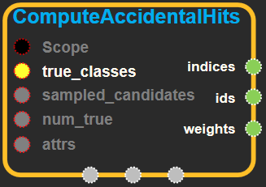

--- 
layout: default 
title: ComputeAccidentalHits 
parent: candidate_sampling_ops 
grand_parent: enuSpace-Tensorflow API 
last_modified_date: now 
--- 

# ComputeAccidentalHits

---

## tensorflow C++ API {#tensorflow-c-api}

[tensorflow::ops::ComputeAccidentalHits](https://www.tensorflow.org/api_docs/cc/class/tensorflow/ops/compute-accidental-hits.html)

Computes the ids of the positions in sampled\_candidates that match true\_labels.

---

## Summary {#summary}

When doing log-odds NCE, the result of this op should be passed through a [SparseToDense](https://www.tensorflow.org/versions/r1.4/api_docs/cc/class/tensorflow/ops/sparse-to-dense.html#classtensorflow_1_1ops_1_1_sparse_to_dense) op, then added to the logits of the sampled candidates. This has the effect of 'removing' the sampled labels that match the true labels by making the classifier sure that they are sampled labels.

Arguments:

* scope: A [Scope](https://www.tensorflow.org/versions/r1.4/api_docs/cc/class/tensorflow/scope.html#classtensorflow_1_1_scope) object
* true\_classes: The true\_classes output of UnpackSparseLabels.
* sampled\_candidates: The sampled\_candidates output of CandidateSampler.
* num\_true: Number of true labels per context.

Optional attributes \(see[`Attrs`](https://www.tensorflow.org/versions/r1.4/api_docs/cc/struct/tensorflow/ops/compute-accidental-hits/attrs.html#structtensorflow_1_1ops_1_1_compute_accidental_hits_1_1_attrs)\):

* seed: If either seed or seed2 are set to be non-zero, the random number generator is seeded by the given seed. Otherwise, it is seeded by a random seed.
* seed2: An second seed to avoid seed collision.

Returns:

* [`Output`](https://www.tensorflow.org/versions/r1.4/api_docs/cc/class/tensorflow/output.html#classtensorflow_1_1_output) indices: A vector of indices corresponding to rows of true\_candidates.
* [`Output`](https://www.tensorflow.org/versions/r1.4/api_docs/cc/class/tensorflow/output.html#classtensorflow_1_1_output) ids: A vector of IDs of positions in sampled\_candidates that match a true\_label for the row with the corresponding index in indices.
* [`Output`](https://www.tensorflow.org/versions/r1.4/api_docs/cc/class/tensorflow/output.html#classtensorflow_1_1_output) weights: A vector of the same length as indices and ids, in which each element is -FLOAT\_MAX.

---

## ComputeAccidentalHits block {#abs-block}

Source link : [https://github.com/EXPNUNI/enuSpaceTensorflow/blob/master/enuSpaceTensorflow/tf\_candidate\_sampling\_ops.cpp](https://github.com/EXPNUNI/enuSpace-Tensorflow/blob/master/enuSpaceTensorflow/tf_candidate_sampling_ops.cpp)

Argument:

* Scope scope : A Scope object \(A scope is generated automatically each page. A scope is not connected.\)
* Input true\_classes: The true\_classes output of UnpackSparseLabels.
* Int64 sampled\_candidates: The sampled\_candidates output of CandidateSampler.
* Int64 num\_true: Number of true labels per context.
* ComputeAccidentalHits::Attrs attrs:
  * seed: If either seed or seed2 are set to be non-zero, the random number generator is seeded by the given seed. Otherwise, it is seeded by a random seed.
  * seed2: An second seed to avoid seed collision.

Return:

* Output `indices`: Output object of ComputeAccidentalHits class object. 
* Output `ids`: Output object of ComputeAccidentalHits class object. 
* Output `weights`: Output object of ComputeAccidentalHits class object. 

Result:

* std::vector\(Tensor\) `result_indices`: A vector of indices corresponding to rows of true\_candidates.
* std::vector\(Tensor\) `result_ids`: A vector of IDs of positions in sampled\_candidates that match a true\_label for the row with the corresponding index in indices.
* std::vector\(Tensor\) `result_weights`: A vector of the same length as indices and ids, in which each element is -FLOAT\_MAX.

---

## Using Method {#using-method}

※

