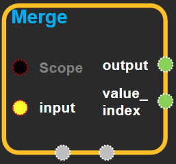
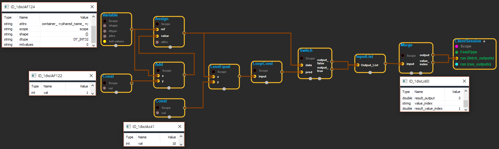
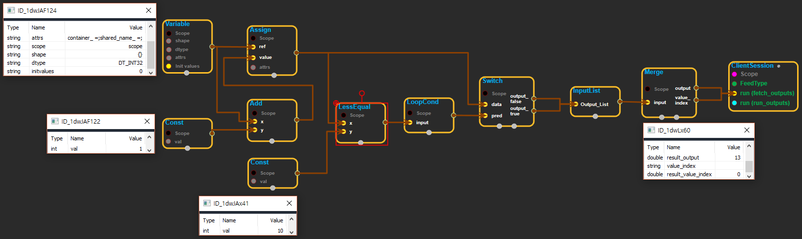

--- 
layout: default 
title: Merge 
parent: control_flow_ops 
grand_parent: enuSpace-Tensorflow API 
last_modified_date: now 
--- 

## Merge

---

## tensorflow C++ API {#tensorflow-c-api}

[tensorflow::ops::Merge](https://www.tensorflow.org/api_docs/cc/class/tensorflow/ops/merge.html)

Forwards the value of an available tensor from `inputs` to `output`.

---

## Summary {#summary}

[`Merge`](https://www.tensorflow.org/api_docs/cc/class/tensorflow/ops/merge.html#classtensorflow_1_1ops_1_1_merge)waits for at least one of the tensors in`inputs`to become available. It is usually combined with[`Switch`](https://www.tensorflow.org/api_docs/cc/class/tensorflow/ops/switch.html#classtensorflow_1_1ops_1_1_switch)to implement branching.

[`Merge`](https://www.tensorflow.org/api_docs/cc/class/tensorflow/ops/merge.html#classtensorflow_1_1ops_1_1_merge)forwards the first tensor to become available to`output`, and sets`value_index`to its index in`inputs`.

Arguments:

* scope: A [Scope](https://www.tensorflow.org/api_docs/cc/class/tensorflow/scope.html#classtensorflow_1_1_scope) object
* inputs: The input tensors, exactly one of which will become available.

Returns:

* [`Output`](https://www.tensorflow.org/api_docs/cc/class/tensorflow/output.html#classtensorflow_1_1_output) output: Will be set to the available input tensor.
* [`Output`](https://www.tensorflow.org/api_docs/cc/class/tensorflow/output.html#classtensorflow_1_1_output) value\_index: The index of the chosen input tensor in `inputs`.

---

## Merge block {#abs-block}

Source link :[https://github.com/EXPNUNI/enuSpaceTensorflow/blob/master/enuSpaceTensorflow/tf\_control\_flow\_ops.cpp](https://github.com/EXPNUNI/enuSpaceTensorflow/blob/master/enuSpaceTensorflow/tf_control_flow_ops.cpp)

Argument:

* Scope scope : A Scope object \(A scope is generated automatically each page. A scope is not connected.\)
* InputList `inputs` :  The input tensors, exactly one of which will become available.

Return:

* [`Output`](https://www.tensorflow.org/api_docs/cc/class/tensorflow/output.html#classtensorflow_1_1_output) output: Will be set to the available input tensor.
* [`Output`](https://www.tensorflow.org/api_docs/cc/class/tensorflow/output.html#classtensorflow_1_1_output) value\_index: The index of the chosen input tensor in `inputs`.

---

## Using Method {#using-method}

※ inputs으로 들어온 inputlist에서 사용 할 수 있는 tensor를 output으로 내보내는 역할을 한다. 위 화면에서 switch값이 11이 되면 value\_index가 0\(리스트에서 첫번째로 들어오는 값이 나오게된다. switch의 output\_false값\)이 된다. 

