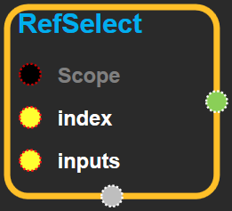
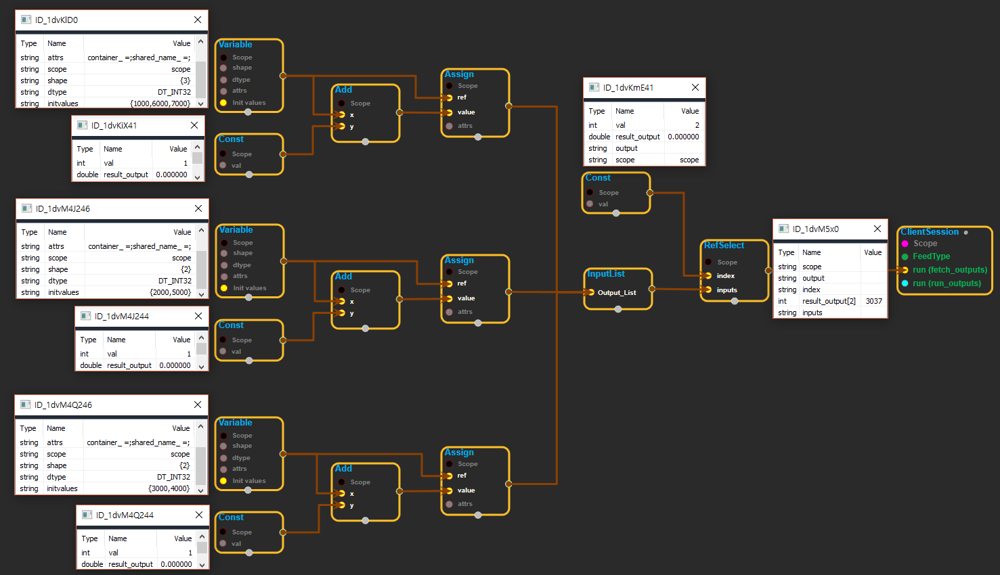

--- 
layout: default 
title: RefSelect 
parent: control_flow_ops 
grand_parent: enuSpace-Tensorflow API 
last_modified_date: now 
--- 

## RefSelect

---

## tensorflow C++ API {#tensorflow-c-api}

[tensorflow::ops::RefSelect](https://www.tensorflow.org/api_docs/cc/class/tensorflow/ops/ref-select.html)

Forwards the `index`th element of `inputs`to `output`.

---

## Summary {#summary}

Arguments:

* scope: A [Scope](https://www.tensorflow.org/api_docs/cc/class/tensorflow/scope.html#classtensorflow_1_1_scope) object
* index: A scalar that determines the input that gets selected.
* inputs: A list of ref tensors, one of which will be forwarded to `output`.

Returns:

* [`Output`](https://www.tensorflow.org/api_docs/cc/class/tensorflow/output.html#classtensorflow_1_1_output): The forwarded tensor.

---

## RefSelect block {#abs-block}

Source link :[https://github.com/EXPNUNI/enuSpaceTensorflow/blob/master/enuSpaceTensorflow/tf\_control\_flow\_ops.cpp](https://github.com/EXPNUNI/enuSpaceTensorflow/blob/master/enuSpaceTensorflow/tf_control_flow_ops.cpp)

Argument:

* Scope scope: A Scope object \(A scope is generated automatically each page. A scope is not connected.\)
* Input index: A scalar that determines the input that gets selected.
* Input inputs: A list of ref tensors, one of which will be forwarded to `output`.

Returns:

* [`Output`](#): The forwarded tensor.

---

## Using Method {#using-method}

※ refselect는 레퍼런스 타입 이므로 assign같은 레퍼런스 타입을 output으로 보내는 변수를 리스트에서 뽑아내는데 유용하다.

