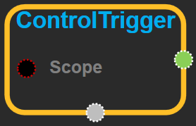

--- 
layout: default 
title: ControlTrigger 
parent: control_flow_ops 
grand_parent: enuSpace-Tensorflow API 
last_modified_date: now 
--- 

# ControlTrigger {#abs}

---

## tensorflow C++ API {#tensorflow-c-api}

[tensorflow::ops::ControlTrigger](https://www.tensorflow.org/api_docs/cc/class/tensorflow/ops/control-trigger.html)

Does nothing.

---

## Summary {#summary}

Serves as a control trigger for scheduling.

Only useful as a placeholder for control edges.

Arguments:

* scope: A [Scope](https://www.tensorflow.org/api_docs/cc/class/tensorflow/scope.html#classtensorflow_1_1_scope) object

Returns:

* the created [`Operation`](https://www.tensorflow.org/api_docs/cc/class/tensorflow/operation.html#classtensorflow_1_1_operation)

---

## ControlTrigger block {#abs-block}

Source link :[https://github.com/EXPNUNI/enuSpaceTensorflow/blob/master/enuSpaceTensorflow/tf\_control\_flow\_ops.cpp](https://github.com/EXPNUNI/enuSpaceTensorflow/blob/master/enuSpaceTensorflow/tf_control_flow_ops.cpp)

Argument:

* Scope scope : A Scope object \(A scope is generated automatically each page. A scope is not connected.\)

Return:

* Operation operation : the created Operation

---

## Using Method {#using-method}

※ placeholder를 초기화 시키기 위한 trigger이지만 core 블럭 중에 [FeedType](https://expnuni.gitbooks.io/enuspacetensorflow/content/core/feedtype.html)이 대신 하므로 사용하지 않는다.

