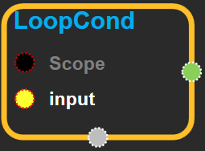

--- 
layout: default 
title: LoopCond 
parent: control_flow_ops 
grand_parent: enuSpace-Tensorflow API 
last_modified_date: now 
--- 

## LoopCond

---

## tensorflow C++ API {#tensorflow-c-api}

[tensorflow::ops::LoopCond](https://www.tensorflow.org/api_docs/cc/class/tensorflow/ops/loop-cond.html)

Forwards the input to the output.

---

## Summary {#summary}

This operator represents the loop termination condition used by the "pivot" switches of a loop.

Arguments:

* scope: A [Scope](https://www.tensorflow.org/api_docs/cc/class/tensorflow/scope.html#classtensorflow_1_1_scope) object 
* input: A boolean scalar, representing the branch predicate of the [Switch](https://www.tensorflow.org/api_docs/cc/class/tensorflow/ops/switch.html#classtensorflow_1_1ops_1_1_switch) op.

Returns:

* [`Output`](https://www.tensorflow.org/api_docs/cc/class/tensorflow/output.html#classtensorflow_1_1_output) : The same tensor as `input`.

---

## LoopCond block {#abs-block}

Source link :[https://github.com/EXPNUNI/enuSpaceTensorflow/blob/master/enuSpaceTensorflow/tf\_control\_flow\_ops.cpp](https://github.com/EXPNUNI/enuSpaceTensorflow/blob/master/enuSpaceTensorflow/tf_control_flow_ops.cpp)

Argument:

* Scope scope : A Scope object \(A scope is generated automatically each page. A scope is not connected.\)
* Input `input` :  A boolean scalar, representing the branch predicate of the [Switch](https://www.tensorflow.org/api_docs/cc/class/tensorflow/ops/switch.html#classtensorflow_1_1ops_1_1_switch) op.

Return:

* Output output : The same tensor as `input`.

---

## Using Method

※ loopcond는 bool타입의 tensor를 받아서 output으로 내보내고, switch블록\(또는 refswitch\)에 사용 된다.

