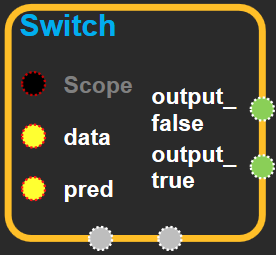
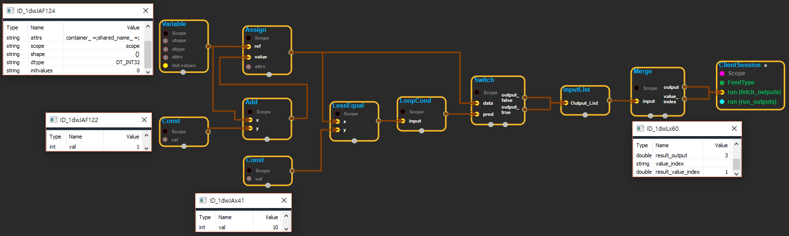

--- 
layout: default 
title: Switch 
parent: control_flow_ops 
grand_parent: enuSpace-Tensorflow API 
last_modified_date: now 
--- 

## Switch

---

## tensorflow C++ API {#tensorflow-c-api}

[tensorflow::ops::Switch](https://www.tensorflow.org/api_docs/cc/class/tensorflow/ops/switch.html)

Forwards `data`to the output port determined by `pred`.

---

## Summary {#summary}

If`pred`is true, the`data`input is forwarded to`output_true`. Otherwise, the data goes to`output_false`.

See also[`RefSwitch`](https://www.tensorflow.org/api_docs/cc/class/tensorflow/ops/ref-switch.html#classtensorflow_1_1ops_1_1_ref_switch)and[`Merge`](https://www.tensorflow.org/api_docs/cc/class/tensorflow/ops/merge.html#classtensorflow_1_1ops_1_1_merge).

Arguments:

* scope: A [Scope](https://www.tensorflow.org/api_docs/cc/class/tensorflow/scope.html#classtensorflow_1_1_scope) object 
* data: The tensor to be forwarded to the appropriate output.
* pred: A scalar that specifies which output port will receive data.

Returns:

* [`Output`](https://www.tensorflow.org/api_docs/cc/class/tensorflow/output.html#classtensorflow_1_1_output)output\_false: If`pred`is false, data will be forwarded to this output.
* [`Output`](https://www.tensorflow.org/api_docs/cc/class/tensorflow/output.html#classtensorflow_1_1_output)output\_true: If`pred`is true, data will be forwarded to this output.

---

## Switch block {#abs-block}

Source link :[https://github.com/EXPNUNI/enuSpaceTensorflow/blob/master/enuSpaceTensorflow/tf\_control\_flow\_ops.cpp](https://github.com/EXPNUNI/enuSpaceTensorflow/blob/master/enuSpaceTensorflow/tf_control_flow_ops.cpp)

Argument:

* Scope scope: A Scope object \(A scope is generated automatically each page. A scope is not connected.\)
* Input data: The tensor to be forwarded to the appropriate output.
* Input pred: A scalar that specifies which output port will receive data.

Returns:

* [`Output`](https://www.tensorflow.org/api_docs/cc/class/tensorflow/output.html#classtensorflow_1_1_output)output\_false: If `pred`is false, data will be forwarded to this output.
* [`Output`](https://www.tensorflow.org/api_docs/cc/class/tensorflow/output.html#classtensorflow_1_1_output)output\_true: If `pred`is true, data will be forwarded to this output.

---

## Using Method {#using-method}

※ merge와 조합하여 output\_false나 output\_true값 중 하나로 나갈 수 있기 때문에 위 화면처럼 분기점 용도로 사용할 수 있다. 

