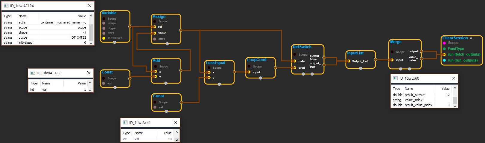

--- 
layout: default 
title: RefSwitch 
parent: control_flow_ops 
grand_parent: enuSpace-Tensorflow API 
last_modified_date: now 
--- 

## RefSwitch

---

## tensorflow C++ API {#tensorflow-c-api}

[tensorflow::ops::RefSwitch](https://www.tensorflow.org/api_docs/cc/class/tensorflow/ops/ref-switch.html)

Forwards the ref tensor `data`to the output port determined by `pred`.

---

## Summary {#summary}

If`pred`is true, the`data`input is forwarded to`output_true`. Otherwise, the data goes to`output_false`.

See also[`Switch`](https://www.tensorflow.org/api_docs/cc/class/tensorflow/ops/switch.html#classtensorflow_1_1ops_1_1_switch)and[`Merge`](https://www.tensorflow.org/api_docs/cc/class/tensorflow/ops/merge.html#classtensorflow_1_1ops_1_1_merge).

Arguments:

* scope: A [Scope](https://www.tensorflow.org/api_docs/cc/class/tensorflow/scope.html#classtensorflow_1_1_scope) object
* data: The ref tensor to be forwarded to the appropriate output.
* pred: A scalar that specifies which output port will receive data.

Returns:

* [`Output`](https://www.tensorflow.org/api_docs/cc/class/tensorflow/output.html#classtensorflow_1_1_output)output\_false: If `pred`is false, data will be forwarded to this output.
* [`Output`](https://www.tensorflow.org/api_docs/cc/class/tensorflow/output.html#classtensorflow_1_1_output)output\_true: If `pred`is true, data will be forwarded to this output.

---

## RefSwitch block {#abs-block}

Source link :[https://github.com/EXPNUNI/enuSpaceTensorflow/blob/master/enuSpaceTensorflow/tf\_control\_flow\_ops.cpp](https://github.com/EXPNUNI/enuSpaceTensorflow/blob/master/enuSpaceTensorflow/tf_control_flow_ops.cpp)

Argument:

* Scope scope: A Scope object \(A scope is generated automatically each page. A scope is not connected.\)
* Input data: The ref tensor to be forwarded to the appropriate output.
* Input pred: A scalar that specifies which output port will receive data.

Returns:

* [`Output`](https://www.tensorflow.org/api_docs/cc/class/tensorflow/output.html#classtensorflow_1_1_output)output\_false: If `pred`is false, data will be forwarded to this output.
* [`Output`](https://www.tensorflow.org/api_docs/cc/class/tensorflow/output.html#classtensorflow_1_1_output)output\_true: If `pred`is true, data will be forwarded to this output.

---

## Using Method {#using-method}

※ switch의 ref버전 이다. data에 레퍼런스 타입의 tensor를 입력한다는 점만 다르고 나머지 사용법은 동일하다.

