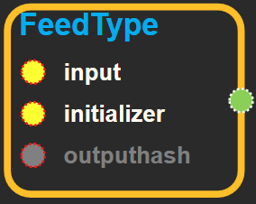
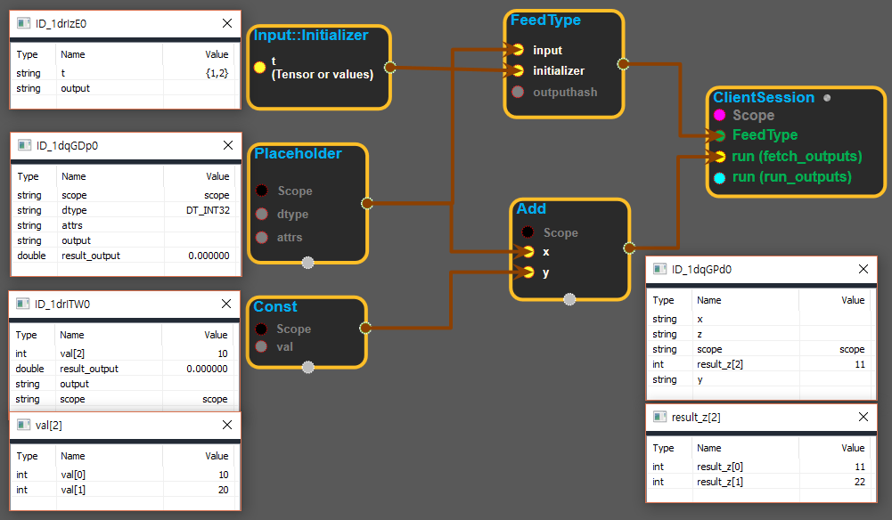

--- 
layout: default 
title: FeedType 
parent: core 
grand_parent: enuSpace-Tensorflow API 
last_modified_date: now 
--- 

## FeedType

---

## tensorflow C++API

Placeholder를 초기화 할때 쓰이는 블록이다.

---

## Summary {#summary}

Placeholder는 단독으로 쓰일 수 없다. Placeholder의 초기화를 위해서 Clientsession의 FeedType에 값을 연결 해주는 역할을 한다.

사용법: Placeholder의 output을 input pin에 연결하고, Input::Initializer의 output을 initializer pin에 연결한다. 그리고 FeedType블록의 output을 Clientsession의 FeedType pin에 연결한다.

Clientsession에서 실행 우선순위는 FeedType이 run\(fetch\_outputs\)보다 먼저 실행 되므로 Placeholder를 다른 함수\(operation\)에 연결해도 실행할 수 있는 것이다.

---

## FeedType block

Source link :[https://github.com/EXPNUNI/enuSpaceTensorflow/blob/master/enuSpaceTensorflow/tf\_core.cpp](https://github.com/EXPNUNI/enuSpaceTensorflow/blob/master/enuSpaceTensorflow/tf_core.cpp)

Argument:

* Input `input`: Placeholder가 연결되는 pin이다.
* Input::Initializer `initializer`: Input::Initializer가 연결되는 pin이다.
* OutputHash `outputHash`: unordered\_map에 저장되어 있는 Output을 불러올때 쓰는 해시 클래스이다.

Output:

* FeedType `output`: clientsession에 전달할 FeedType을 내보낸다.

---

## UsingMethod

※ input\_initializer, placeholder를 연결하여 clientsession의 FeedType연결하여 사용하는 경우

