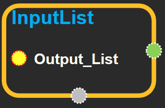
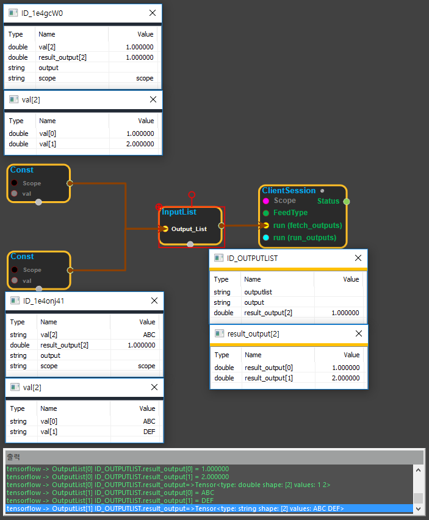

--- 
layout: default 
title: InputList 
parent: core 
grand_parent: enuSpace-Tensorflow API 
last_modified_date: now 
--- 

# InputList

---

## tensorflow C++ API

[tensorflow::InputList](https://www.tensorflow.org/api_docs/cc/class/tensorflow/input-list.html)

A type for representing the input to ops that require a list of tensors.

---

## Public functions {#public-functions_1}

### InputList {#inputlist}

```
InputList(
  const OutputList & out
)
```

Implicitly convert a list of outputs to a list of inputs.

This is useful to write code such as ops::Concat\(ops::Split\(x, 4\)\).

### InputList {#inputlist}

```
InputList(
  const std::initializer_list< Input > & inputs
)
```

### InputList {#inputlist}

```
 InputList(
  const tensorflow::gtl::ArraySlice< Input > & inputs
)
```

### InputList {#inputlist}

```
 InputList(
  const std::initializer_list< Output > & out
)
```

### begin {#begin}

```
std::vector< Input >::iterator begin()
```

### begin {#begin_5}

```
std::vector< Input >::const_iterator begin() const
```

### end {#end}

```
std::vector< Input >::iterator end()
```

### end {#end_6}

```
std::vector< Input >::const_iterator end() const
```

---

## InputList block

Source link :[https://github.com/EXPNUNI/enuSpaceTensorflow/blob/master/enuSpaceTensorflow/tf\_core.cpp](https://github.com/EXPNUNI/enuSpaceTensorflow/blob/master/enuSpaceTensorflow/tf_core.cpp)



Argument:

* OutputList `outputlist`: Create an InputList by concatenating several output or output lists.

Output:

* InputList `output`: Returns the inputlist using output and outputlist.

---

## UsingMethod

InputList는 여러개의 Output 객체를 연결할수 있으며, 연결된 정보는 출력 메세지 창에 출력값이 현시되며, enuSpace의 Table 다이얼로그에는 첫번째 연결된 Output객체의 값에 대해서 현시한다.



※ InputList 동작 확인

