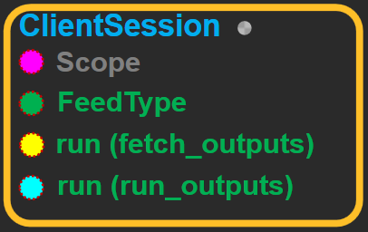

--- 
layout: default 
title: ClientSession 
parent: core 
grand_parent: enuSpace-Tensorflow API 
last_modified_date: now 
--- 

# ClientSession {#abs}

---

## tensorflow C++ API {#tensorflow-c-api}

[tensorflow::ClientSession](https://www.tensorflow.org/api_docs/cc/class/tensorflow/client-session.html)

A [`ClientSession`](https://www.tensorflow.org/api_docs/cc/class/tensorflow/client-session.html#classtensorflow_1_1_client_session) object lets the caller drive the evaluation of the TensorFlow graph constructed with the C++ API.

---

## Summary {#summary}

Example:

```cpp
Scope root =Scope::NewRootScope();
auto a =Placeholder(root, DT_INT32);
auto c =Add(root, a,{41});

ClientSession session(root);
std::vector outputs;

Status s = session.Run({{a,{1}}},{c},&outputs);
if(!s.ok()){...}
```

---

## Public types {#public-types_1}

### FeedType

`std::unordered_map< Output, Input::Initializer, OutputHash > FeedType`

A data type to represent feeds to a Run call.

This is a map of Output objects returned by op-constructors to the value to feed them with. See Input::Initializer for details on what can be used as feed values.

---

## Public functions {#public-functions_2}

### ClientSession {#clientsession}

```cpp
ClientSession(
  const Scope & scope,
  const string & target
)
```

Create a new session to evaluate the graph contained in `scope`by connecting to the TensorFlow runtime specified by `target`.

### ClientSession

```cpp
ClientSession(
    const Scope & scope
)
```

Same as above, but use the empty string \(""\) as the target specification.

### 

ClientSession

```cpp
ClientSession(
    const Scope & scope,
    const SessionOptions & session_options
)
```

Create a new session, configuring it with session\_options.

### Run

```cpp
Status Run(
  const std::vector< Output > & fetch_outputs,
  std::vector< Tensor > *outputs
) const
```

Evaluate the tensors in fetch\_outputs.  
 The values are returned as Tensor objects in outputs. The number and order of outputs will match fetch\_outputs.

### Run

```cpp
Status Run(
  const FeedType & inputs,
  const std::vector< Output > & fetch_outputs,
  std::vector< Tensor > *outputs
) const
```

Same as above, but use the mapping in inputs as feeds.

### Run

```cpp
Status Run(
  const RunOptions & run_options,
  const FeedType & inputs,
  const std::vector< Output > & fetch_outputs,
  const std::vector< Operation > & run_outputs,
  std::vector< Tensor > *outputs,
  RunMetadata *run_metadata
) const
```

Use run\_options to turn on performance profiling.  
 run\_metadata, if not null, is filled in with the profiling results.

### ~ClientSession

```
~ClientSession()
```

---

## ClientSession block {#abs-block}

Source link :[https://github.com/EXPNUNI/enuSpaceTensorflow/blob/master/enuSpaceTensorflow/tf\_core.cpp](https://github.com/EXPNUNI/enuSpaceTensorflow/blob/master/enuSpaceTensorflow/tf_core.cpp)



Argument:

* Scope scope : A Scope object \(A scope is generated automatically each page. A scope is not connected.\)
* Inputs `FeedType`: A data type to represent feeds to a Run call. This is a map of[`Output`](https://www.tensorflow.org/api_docs/cc/class/tensorflow/output.html#classtensorflow_1_1_output)objects returned by op-constructors to the value to feed them with. See[`Input::Initializer`](https://www.tensorflow.org/api_docs/cc/struct/tensorflow/input/initializer.html#structtensorflow_1_1_input_1_1_initializer)for details on what can be used as feed values.
* const std::vector&lt;[Output](https://www.tensorflow.org/api_docs/cc/class/tensorflow/output.html#classtensorflow_1_1_output)&gt;& `run(fetch_outputs)` : Evaluate the tensors in`fetch_outputs`. The values are returned as[`Tensor`](https://www.tensorflow.org/api_docs/cc/class/tensorflow/tensor.html#classtensorflow_1_1_tensor)objects in`outputs`. The number and order of`outputs`will match`fetch_outputs`.
* const std::vector&lt;[Operation](https://www.tensorflow.org/api_docs/cc/class/tensorflow/operation.html#classtensorflow_1_1_operation)&gt;& `run(run_outputs)`: Same as above. Additionally runs the operations ins `run_outputs`.

---

## Using Method {#using-method}


