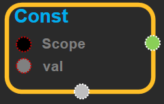

--- 
layout: default 
title: Const 
parent: core 
grand_parent: enuSpace-Tensorflow API 
last_modified_date: now 
--- 

# Const

---

## tensorflow C++ API

Create output using tensor and scope.

---

## Const block

Source link :[https://github.com/EXPNUNI/enuSpaceTensorflow/blob/master/enuSpaceTensorflow/tf\_core.cpp](https://github.com/EXPNUNI/enuSpaceTensorflow/blob/master/enuSpaceTensorflow/tf_core.cpp)

Argument:

* Scope scope : A Scope object \(A scope is generated automatically each page. A scope is not connected.\)
* Input::Initializer  `val`: The value of the input variable. It can be written in python syntax. \(ex: {1,2} -&gt; shape: \[2\], input\[1\] = 1  input\[2\] = 2\)

Output:

* Output `output`: return output type of tensor

---

## UsingMethod

※ Const블럭은 output을 내보내기 때문에 여러곳에 쓰인다.

