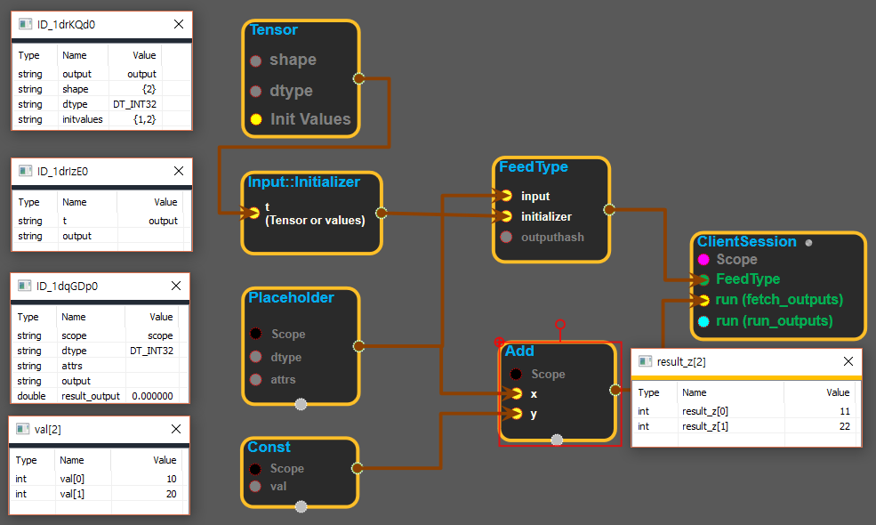

--- 
layout: default 
title: InputInitializer 
parent: core 
grand_parent: enuSpace-Tensorflow API 
last_modified_date: now 
--- 

## Input::Initializer

---

## tensorflowC++API

[tensorflow::Input::Initializer](https://www.tensorflow.org/api_docs/cc/struct/tensorflow/input/initializer)

R [Initializer](https://www.tensorflow.org/api_docs/cc/struct/tensorflow/input/initializer.html#structtensorflow_1_1_input_1_1_initializer) enables constructing an [Input](https://www.tensorflow.org/api_docs/cc/class/tensorflow/input.html#classtensorflow_1_1_input) object from various kinds of C++ constants such as simple primitive constants and nested initializer lists representing a multi-dimensional array.

---

## Summary {#summary}

[Initializer](https://www.tensorflow.org/api_docs/cc/struct/tensorflow/input/initializer.html#structtensorflow_1_1_input_1_1_initializer) constructors are all templates, so the aforementioned kinds of C++ constants can be used to construct an [Initializer](https://www.tensorflow.org/api_docs/cc/struct/tensorflow/input/initializer.html#structtensorflow_1_1_input_1_1_initializer). [Initializer](https://www.tensorflow.org/api_docs/cc/struct/tensorflow/input/initializer.html#structtensorflow_1_1_input_1_1_initializer) stores the value it got constructed with in a [Tensor](https://www.tensorflow.org/api_docs/cc/class/tensorflow/tensor.html#classtensorflow_1_1_tensor) object.

---

## Input::Initializer block

Source link :[https://github.com/EXPNUNI/enuSpaceTensorflow/blob/master/enuSpaceTensorflow/tf\_core.cpp](https://github.com/EXPNUNI/enuSpaceTensorflow/blob/master/enuSpaceTensorflow/tf_core.cpp)

Argument:

* Tensor `t`: The value of the input variable. It can be written in python syntax. \(ex: {1,2} -&gt; shape: \[2\], input\[1\] = 1  input\[2\] = 2\)

Output:

* Input::Initializer `output`: Returns Input :: Initializer. Input :: Initializer is usually used to initialize the placeholder.

---

## UsingMethod

※input\_initializer에서 tensor를 직접 생성하여 placeholder를 사용하는 경우

※tensor 블록을 이용하여 placeholder를 사용하는 경우

