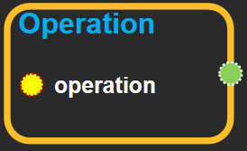
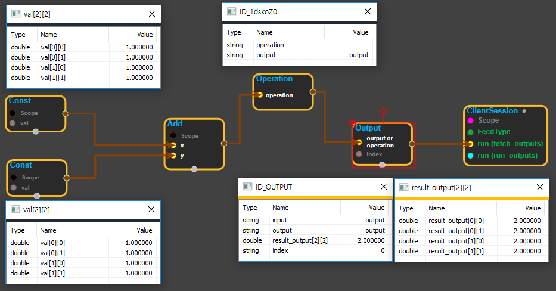

--- 
layout: default 
title: Operation 
parent: core 
grand_parent: enuSpace-Tensorflow API 
last_modified_date: now 
--- 

# Operation

---

## tensorflow C++ API

[tensorflow::Operation](https://www.tensorflow.org/api_docs/cc/class/tensorflow/operation.html)

Represents a node in the computation graph.

---

## Public functions {#public-functions_1}

### Operation {#operation}

```
 Operation()
```

### Operation {#operation}

```
 Operation(
  Node *n
)
```

### hash {#hash}

```
uint64 hash(
  int32 index
) const
```

### input {#input}

```
Output input(
  int32 i
) const
```

### input\_type {#input_type}

```
DataType input_type(
  int32 o
) const
```

### node {#node}

```
Node * node() const
```

### num\_inputs {#num_inputs}

```
int32 num_inputs() const
```

### num\_outputs {#num_outputs}

```
int32 num_outputs() const
```

### operator== {#operator}

```
bool operator==(
  const Operation & other
) const
```

### output {#output}

```
Output output(
  int32 i
) const
```

### output\_type {#output_type}

```
DataType output_type(
  int32 o
) const
```

---

## Operation block

Source link :[https://github.com/EXPNUNI/enuSpaceTensorflow/blob/master/enuSpaceTensorflow/tf\_core.cpp](https://github.com/EXPNUNI/enuSpaceTensorflow/blob/master/enuSpaceTensorflow/tf_core.cpp)



Argument:

* Operation `operation`: Create an operation by concatenating the output from the function.

Output:

* Operation `output`: Returns the operation

---

## UsingMethod

※ Add블럭의 결과물을 operation에 연결한뒤 다시 output 블럭에 연결하여 ClientSession에 연결하여 실행한 화면

※ 참고로 Operation은 ClientSession의 run\(run\_outputs\) 핀에 연결할 수 있으나 결과값은 나오지 않는다.

