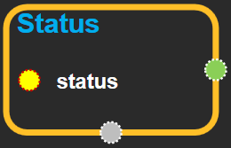

--- 
layout: default 
title: Status 
parent: core 
grand_parent: enuSpace-Tensorflow API 
last_modified_date: now 
--- 

# Status

---

## tensorflow C++ API {#tensorflow-c-api}

[tensorflow::Status](https://www.tensorflow.org/api_docs/cc/class/tensorflow/status.html)

Denotes success or failure of a call in Tensorflow.

---

## Public functions {#public-functions_1}

### IgnoreError {#ignoreerror}

```
void IgnoreError() const
```

### Status {#status}

```
Status()
```

Create a success status.

### Status {#status_2}

```
Status(
  tensorflow::error::Code code,
  tensorflow::StringPiece msg
)
```

Create a status with the specified error code and msg as a human-readable string containing more detailed information.

### Status

{\#tostring}

```
Status(
    const Status & s
)
```

Copy the specified status.Status

### 

ToString {\#tostring}

```
string ToString() const
```

Return a string representation of this status suitable for printing.

Returns the string`"OK"`for success.

### Update {#update}

```
void Update(
  const Status & new_status
)
```

If[`ok()`](https://www.tensorflow.org/api_docs/cc/class/tensorflow/status.html#classtensorflow_1_1_status_1a6c078283eadeeb5ed337f36582138c00), stores`new_status`into`*this`.

If`!ok()`, preserves the current status, but may augment with additional information about`new_status`.

Convenient way of keeping track of the first error encountered. Instead of:`if (overall_status.ok()) overall_status = new_status`Use:`overall_status.Update(new_status);`

### code {#code}

```
tensorflow::error::Code code() const
```

### error\_message {#error_message}

```
const string & error_message() const
```

### ok {#ok}

```
bool ok() const
```

Returns true iff the status indicates success.

### operator!= {#operator}

```
bool operator!=(
  const Status & x
) const
```

### operator= {#operator}

```
void operator=(
  const Status & s
)
```

### operator== {#operator_5}

```
bool operator==(
  const Status & x
) const
```

### ~Status {#status_6}

```
~
Status
()
```

---

## Public static functions {#public-static-functions_7}

### OK {#ok_8}

```
Status OK()
```

---

## Status Block

Source link :[https://github.com/EXPNUNI/enuSpaceTensorflow/blob/master/enuSpaceTensorflow/tf\_core.cpp](https://github.com/EXPNUNI/enuSpaceTensorflow/blob/master/enuSpaceTensorflow/tf_core.cpp)



Argument:

* Status status: Get the status of clientsession.

Output:

* Output `output`: Print status error or result string.


