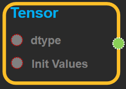
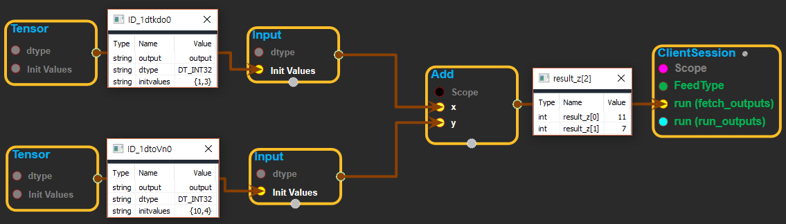
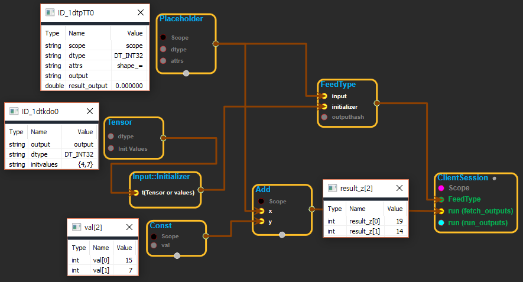

--- 
layout: default 
title: Tensor 
parent: core 
grand_parent: enuSpace-Tensorflow API 
last_modified_date: now 
--- 

# Tensor

---

## tensorflow C++ API

[tensorflow::Tensor](https://www.tensorflow.org/api_docs/cc/class/tensorflow/tensor.html)

Represents an n-dimensional array of values.

---

## Public functions

### AllocatedBytes

```
size_t AllocatedBytes() const
```

### AsProtoField {#asprotofield}

```
void AsProtoField(
    TensorProto *proto
) const
```

Fills in`proto`with`*this`tensor's content.

[`AsProtoField()`](https://www.tensorflow.org/api_docs/cc/class/tensorflow/tensor.html#classtensorflow_1_1_tensor_1a55198b51aab7ca4ef312416c2b742eec)fills in the repeated field for`proto.dtype()`, while`AsProtoTensorContent()`encodes the content in`proto.tensor_content()`in a compact form.

### AsProtoTensorContent {#asprototensorcontent}

```
void AsProtoTensorContent(
    TensorProto *proto
) const
```

### CopyFrom {#copyfrom}

```
bool CopyFrom(
  const Tensor & other,
  const TensorShape & shape
) TF_MUST_USE_RESULT
```

Copy the other tensor into this tensor and reshape it.

This tensor shares other's underlying storage. Returns`true`iff`other.shape()`has the same number of elements of the given`shape`.

### DebugString

```
string DebugString() const
```

A human-readable summary of the tensor suitable for debugging.

### FillDescription {#filldescription}

```
void FillDescription(
    TensorDescription *description
) const
```

Fill in the`TensorDescription`proto with metadata about the tensor that is useful for monitoring and debugging.

### FromProto {#fromproto}

```
bool FromProto(
 const TensorProto & other
)  TF_MUST_USE_RESULT
```

Parse`other`and construct the tensor.

Returns`true`iff the parsing succeeds. If the parsing fails, the state of`*this`is unchanged.

### FromProto {#fromproto_2}

```
bool FromProto(
 Allocator *a,
 const TensorProto & other
)  TF_MUST_USE_RESULT
```

### IsAligned {#isaligned}

```
bool IsAligned() const
```

Returns true iff this tensor is aligned.

### IsInitialized {#isinitialized}

```
bool IsInitialized() const
```

If necessary, has this [Tensor](https://www.tensorflow.org/api_docs/cc/class/tensorflow/tensor.html#classtensorflow_1_1_tensor) been initialized?

Zero-element Tensors are always considered initialized, even if they have never been assigned to and do not have any memory allocated.

### IsSameSize {#issamesize}

```
bool IsSameSize(
  const Tensor & b
) const
```

### NumElements {#numelements}

```
int64 NumElements() const
```

Convenience accessor for the tensor shape.

### SharesBufferWith {#sharesbufferwith}

```
 bool SharesBufferWith(
  const Tensor & b
) const
```

### Slice {#slice}

```
Tensor Slice(
  int64 dim0_start,
  int64 dim0_limit
) const
```

Slice this tensor along the 1st dimension.

I.e., the returned tensor satisfies returned\[i, ...\] == this\[dim0\_start + i, ...\]. The returned tensor shares the underlying tensor buffer with this tensor.

NOTE: The returned tensor may not satisfies the same alignment requirement as this tensor depending on the shape. The caller must check the returned tensor's alignment before calling certain methods that have alignment requirement \(e.g.,[`flat()`](https://www.tensorflow.org/api_docs/cc/class/tensorflow/tensor.html#classtensorflow_1_1_tensor_1a67ce62becce1e70454d9756d1d5ed996),`tensor()`\).

REQUIRES:[`dims()`](https://www.tensorflow.org/api_docs/cc/class/tensorflow/tensor.html#classtensorflow_1_1_tensor_1ac8a173cc6c97184139bfd81ff45e7da9)&gt;= 1 REQUIRES:`0 <= dim0_start <= dim0_limit <= dim_size(0)`

### SummarizeValue {#summarizevalue}

```
string SummarizeValue(
  int64 max_entries
) const
```

Render the first`max_entries`values in`*this`into a string.

### Tensor {#tensor}

```
Tensor()
```

Creates a 1-dimensional, 0-element float tensor.

The returned [Tensor](https://www.tensorflow.org/api_docs/cc/class/tensorflow/tensor.html#classtensorflow_1_1_tensor) is not a scalar \(shape {}\), but is instead an empty one-dimensional [Tensor](https://www.tensorflow.org/api_docs/cc/class/tensorflow/tensor.html#classtensorflow_1_1_tensor)\(shape {0}, [NumElements\(\)](https://www.tensorflow.org/api_docs/cc/class/tensorflow/tensor.html#classtensorflow_1_1_tensor_1a9dcfa39b1a721efeef32cf3692938a3a) == 0\). Since it has no elements, it does not need to be assigned a value and is initialized by default \([IsInitialized\(\)](https://www.tensorflow.org/api_docs/cc/class/tensorflow/tensor.html#classtensorflow_1_1_tensor_1aa44336c38c4baf3ed69f63aee131ba87) is true\). If this is undesirable, consider creating a one-element scalar which does require initialization:

\`\`\`c++

```
Tensor(DT_FLOAT, TensorShape({}))
```

\`\`\`

### Tensor {#tensor_3}

```
Tensor(
    DataType type,
    constTensorShape & shape
)
```

Creates a [Tensor](https://www.tensorflow.org/api_docs/cc/class/tensorflow/tensor.html#classtensorflow_1_1_tensor) of the given`type`and`shape`.

If LogMemory::IsEnabled\(\) the allocation is logged as coming from an unknown kernel and step. Calling the [Tensor](https://www.tensorflow.org/api_docs/cc/class/tensorflow/tensor.html#classtensorflow_1_1_tensor) constructor directly from within an Op is deprecated: use the OpKernelConstruction/OpKernelContext allocate\_\* methods to allocate a new tensor, which record the kernel and step.

The underlying buffer is allocated using a`CPUAllocator`.

### Tensor {#tensor_4}

```
Tensor(
 Allocator *a,
 DataType type,
 const TensorShape & shape
)
```

Creates a tensor with the input`type`and`shape`, using the allocator`a`to allocate the underlying buffer.

If LogMemory::IsEnabled\(\) the allocation is logged as coming from an unknown kernel and step. Calling the [Tensor](https://www.tensorflow.org/api_docs/cc/class/tensorflow/tensor.html#classtensorflow_1_1_tensor) constructor directly from within an Op is deprecated: use the OpKernelConstruction/OpKernelContext allocate\_\* methods to allocate a new tensor, which record the kernel and step.

`a`must outlive the lifetime of this [Tensor](https://www.tensorflow.org/api_docs/cc/class/tensorflow/tensor.html#classtensorflow_1_1_tensor).

### Tensor {#tensor_5}

```
Tensor(
 Allocator *a,
 DataType type,
 const TensorShape & shape,
 const AllocationAttributes & allocation_attr
)
```

Creates a tensor with the input`type`and`shape`, using the allocator`a`and the specified "allocation\_attr" to allocate the underlying buffer.

If the kernel and step are known allocation\_attr.allocation\_will\_be\_logged should be set to true and LogMemory::RecordTensorAllocation should be called after the tensor is constructed. Calling the [Tensor](https://www.tensorflow.org/api_docs/cc/class/tensorflow/tensor.html#classtensorflow_1_1_tensor) constructor directly from within an Op is deprecated: use the OpKernelConstruction/OpKernelContext allocate\_\* methods to allocate a new tensor, which record the kernel and step.

`a`must outlive the lifetime of this [Tensor](https://www.tensorflow.org/api_docs/cc/class/tensorflow/tensor.html#classtensorflow_1_1_tensor).

### Tensor {#tensor_6}

```
Tensor(
 DataType type
)
```

Creates an empty [Tensor](https://www.tensorflow.org/api_docs/cc/class/tensorflow/tensor.html#classtensorflow_1_1_tensor) of the given data type.

Like [Tensor\(\)](https://www.tensorflow.org/api_docs/cc/class/tensorflow/tensor.html#classtensorflow_1_1_tensor_1aebe57070a84f43b98e63671f52a117fe), returns a 1-dimensional, 0-element [Tensor](https://www.tensorflow.org/api_docs/cc/class/tensorflow/tensor.html#classtensorflow_1_1_tensor) with [IsInitialized\(\)](https://www.tensorflow.org/api_docs/cc/class/tensorflow/tensor.html#classtensorflow_1_1_tensor_1aa44336c38c4baf3ed69f63aee131ba87) returning True. See the [Tensor\(\)](https://www.tensorflow.org/api_docs/cc/class/tensorflow/tensor.html#classtensorflow_1_1_tensor_1aebe57070a84f43b98e63671f52a117fe) documentation for details.

### Tensor {#tensor_7}

```
Tensor(
  const Tensor & other
)
```

Copy constructor.

### Tensor {#tensor_8}

```
Tensor(
  Tensor && other
)
```

Move constructor.

After this call,is safely destructible and can be assigned to, but other calls on it \(e.g. shape manipulation\) are not valid.

### TotalBytes {#totalbytes}

```
size_t TotalBytes() const
```

Returns the estimated memory usage of this tensor.

### UnsafeCopyFromInternal {#unsafecopyfrominternal}

```
void UnsafeCopyFromInternal(
  const Tensor &,
  DataType dtype,
  const TensorShape &
)
```

Copy the other tensor into this tensor and reshape it and reinterpret the buffer's datatype.

This tensor shares other's underlying storage.

### bit\_casted\_shaped {#bit_casted_shaped}

```
TTypes< T, NDIMS >::Tensor bit_casted_shaped(
  gtl::ArraySlice< int64 > new_sizes
)
```

Return the tensor data to an`Eigen::Tensor`with the new shape specified in`new_sizes`and cast to a new dtype`T`.

Using a bitcast is useful for move and copy operations. The allowed bitcast is the only difference from`shaped()`.

### bit\_casted\_shaped {#bit_casted_shaped_9}

```
TTypes< T, NDIMS >::ConstTensor bit_casted_shaped(
  gtl::ArraySlice< int64 > new_sizes
)const
```

Return the tensor data to an`Eigen::Tensor`with the new shape specified in`new_sizes`and cast to a new dtype`T`.

Using a bitcast is useful for move and copy operations. The allowed bitcast is the only difference from`shaped()`.

### bit\_casted\_tensor {#bit_casted_tensor}

```
TTypes< T, NDIMS >::Tensor bit_casted_tensor()
```

Return the tensor data to an`Eigen::Tensor`with the same size but a bitwise cast to the specified dtype`T`.

Using a bitcast is useful for move and copy operations. NOTE: this is the same as`tensor()`except a bitcast is allowed.

### bit\_casted\_tensor {#bit_casted_tensor_10}

```
TTypes< T, NDIMS >::ConstTensor bit_casted_tensor() const
```

Return the tensor data to an`Eigen::Tensor`with the same size but a bitwise cast to the specified dtype`T`.

Using a bitcast is useful for move and copy operations. NOTE: this is the same as`tensor()`except a bitcast is allowed.

### dim\_size {#dim_size}

```
int64 dim_size(
 int d
) const
```

Convenience accessor for the tensor shape.

### dims {#dims}

```
int dims() const
```

Convenience accessor for the tensor shape.

For all shape accessors, see comments for relevant methods of`TensorShape`in`tensor_shape.h`.

### dtype {#dtype}

```
DataType dtype() const
```

Returns the data type.

### flat {#flat}

```
TTypes< T >::Flat flat()
```

Return the tensor data as an`Eigen::Tensor`of the data type and a specified shape.

These methods allow you to access the data with the dimensions and sizes of your choice. You do not need to know the number of dimensions of the[Tensor](https://www.tensorflow.org/api_docs/cc/class/tensorflow/tensor.html#classtensorflow_1_1_tensor)to call them. However, they`CHECK`that the type matches and the dimensions requested creates an`Eigen::Tensor`with the same number of elements as the tensor.

Example:

\`\`\`c++

```
typedeffloat T;
Tensor my_ten(...built withShape{planes:4, rows:3, cols:5}...);
// 1D Eigen::Tensor, size 60:
auto flat = my_ten.flat();
// 2D Eigen::Tensor 12 x 5:
auto inner = my_ten.flat_inner_dims();
// 2D Eigen::Tensor 4 x 15:
auto outer = my_ten.shaped({4,15});
// CHECK fails, bad num elements:
auto outer = my_ten.shaped({4,8});
// 3D Eigen::Tensor 6 x 5 x 2:
auto weird = my_ten.shaped({6,5,2});
// CHECK fails, type mismatch:
auto bad   = my_ten.flat();
```

\`\`\`

### flat {#flat_11}

```
TTypes< T >::ConstFlat flat() const
```

### flat\_inner\_dims {#flat_inner_dims}

```
TTypes< T, NDIMS >::Tensor flat_inner_dims()
```

Returns the data as an Eigen::Tensor with NDIMS dimensions, collapsing all [Tensor](https://www.tensorflow.org/api_docs/cc/class/tensorflow/tensor.html#classtensorflow_1_1_tensor) dimensions but the last NDIMS-1 into the first dimension of the result.

If NDIMS &gt; [dims\(\)](https://www.tensorflow.org/api_docs/cc/class/tensorflow/tensor.html#classtensorflow_1_1_tensor_1ac8a173cc6c97184139bfd81ff45e7da9) then leading dimensions of size 1 will be added to make the output rank NDIMS.

### flat\_inner\_dims {#flat_inner_dims_12}

```
TTypes< T, NDIMS >::ConstTensor flat_inner_dims() const
```

### flat\_inner\_outer\_dims {#flat_inner_outer_dims}

```
TTypes< T, NDIMS >::Tensor flat_inner_outer_dims(
  int64 begin
)
```

Returns the data as an Eigen::Tensor with NDIMS dimensions, collapsing the first 'begin' [Tensor](https://www.tensorflow.org/api_docs/cc/class/tensorflow/tensor.html#classtensorflow_1_1_tensor) dimensions into the first dimension of the result and the [Tensor](https://www.tensorflow.org/api_docs/cc/class/tensorflow/tensor.html#classtensorflow_1_1_tensor) dimensions of the last [dims\(\)](https://www.tensorflow.org/api_docs/cc/class/tensorflow/tensor.html#classtensorflow_1_1_tensor_1ac8a173cc6c97184139bfd81ff45e7da9) - 'begin' - NDIMS into the last dimension of the result.

If 'begin' &lt; 0 then the \|'begin'\| leading dimensions of size 1 will be added. If 'begin' + NDIMS &gt; [dims\(\)](https://www.tensorflow.org/api_docs/cc/class/tensorflow/tensor.html#classtensorflow_1_1_tensor_1ac8a173cc6c97184139bfd81ff45e7da9) then 'begin' + NDIMS - [dims\(\)](https://www.tensorflow.org/api_docs/cc/class/tensorflow/tensor.html#classtensorflow_1_1_tensor_1ac8a173cc6c97184139bfd81ff45e7da9) trailing dimensions of size 1 will be added.

### flat\_inner\_outer\_dims {#flat_inner_outer_dims_13}

```
TTypes< T, NDIMS >::ConstTensor flat_inner_outer_dims(
  int64 begin
) const
```

### flat\_outer\_dims {#flat_outer_dims}

```
TTypes< T, NDIMS >::Tensor flat_outer_dims()
```

Returns the data as an Eigen::Tensor with NDIMS dimensions, collapsing all[Tensor](https://www.tensorflow.org/api_docs/cc/class/tensorflow/tensor.html#classtensorflow_1_1_tensor)dimensions but the first NDIMS-1 into the last dimension of the result.

If NDIMS &gt;[dims\(\)](https://www.tensorflow.org/api_docs/cc/class/tensorflow/tensor.html#classtensorflow_1_1_tensor_1ac8a173cc6c97184139bfd81ff45e7da9)then trailing dimensions of size 1 will be added to make the output rank NDIMS.

### flat\_outer\_dims {#flat_outer_dims_14}

```
TTypes< T, NDIMS >::ConstTensor flat_outer_dims() const
```

### matrix {#matrix}

```
TTypes< T >::Matrix matrix()
```

### matrix {#matrix_15}

```
TTypes< T >::ConstMatrix matrix() const
```

### operator= {#operator}

```
Tensor & operator=(
  const Tensor & other
)
```

Assign operator. This tensor shares other's underlying storage.

### operator= {#operator_16}

```
Tensor & operator=(
  Tensor && other
)
```

Move operator. See move constructor for details.

### scalar {#scalar}

```
TTypes< T >::Scalar scalar()
```

Return the [Tensor](https://www.tensorflow.org/api_docs/cc/class/tensorflow/tensor.html#classtensorflow_1_1_tensor) data as a`TensorMap`of fixed size 1:`TensorMap>`.

Using[`scalar()`](https://www.tensorflow.org/api_docs/cc/class/tensorflow/tensor.html#classtensorflow_1_1_tensor_1aacce92855f6b83eea728203de8016c78)allows the compiler to perform optimizations as the size of the tensor is known at compile time.

### scalar {#scalar_17}

```
TTypes< T >::ConstScalar scalar() const
```

### shape {#shape}

```
const Tensor Shape& shape() const
```

Returns the shape of the tensor.

### shaped {#shaped}

```
TTypes< T, NDIMS >::Tensor shaped(
  gtl::ArraySlice< int64 > new_sizes
)
```

### shaped {#shaped_18}

```
TTypes< T, NDIMS >::ConstTensor shaped(
  gtl::ArraySlice< int64 > new_sizes
) const
```

### tensor {#tensor_19}

```
TTypes< T, NDIMS >::Tensor tensor()
```

### tensor {#tensor_20}

```
TTypes< T, NDIMS >::ConstTensor tensor() const
```

### tensor\_data {#tensor_data}

```
StringPiece tensor_data() const
```

Returns a`StringPiece`mapping the current tensor's buffer.

The returned`StringPiece`may point to memory location on devices that the CPU cannot address directly.

NOTE: The underlying tensor buffer is refcounted, so the lifetime of the contents mapped by the`StringPiece`matches the lifetime of the buffer; callers should arrange to make sure the buffer does not get destroyed while the`StringPiece`is still used.

REQUIRES:`DataTypeCanUseMemcpy(dtype())`.

### unaligned\_flat {#unaligned_flat}

```
TTypes< T >::UnalignedFlat unaligned_flat()
```

### unaligned\_flat {#unaligned_flat_21}

```
TTypes< T >::UnalignedConstFlat unaligned_flat() const
```

### unaligned\_shaped {#unaligned_shaped}

```
TTypes< T, NDIMS >::UnalignedTensor unaligned_shaped(
  gtl::ArraySlice< int64 > new_sizes
)
```

### unaligned\_shaped {#unaligned_shaped_22}

```
TTypes< T, NDIMS >::UnalignedConstTensor unaligned_shaped(
  gtl::ArraySlice< int64 > new_sizes
) const
```

### vec {#vec}

```
TTypes< T >::Vec vec()
```

Return the tensor data as an`Eigen::Tensor`with the type and sizes of this[`Tensor`](https://www.tensorflow.org/api_docs/cc/class/tensorflow/tensor.html#classtensorflow_1_1_tensor).

Use these methods when you know the data type and the number of dimensions of the [Tensor](https://www.tensorflow.org/api_docs/cc/class/tensorflow/tensor.html#classtensorflow_1_1_tensor) and you want an`Eigen::Tensor`automatically sized to the[`Tensor`](https://www.tensorflow.org/api_docs/cc/class/tensorflow/tensor.html#classtensorflow_1_1_tensor)sizes. The implementation check fails if either type or sizes mismatch.

Example:

\`\`\`c++

```
typedeffloat T;
Tensor my_mat(...built withShape{rows:3, cols:5}...);
auto mat = my_mat.matrix();// 2D Eigen::Tensor, 3 x 5.
auto mat = my_mat.tensor();// 2D Eigen::Tensor, 3 x 5.
auto vec = my_mat.vec();// CHECK fails as my_mat is 2D.
auto vec = my_mat.tensor();// CHECK fails as my_mat is 2D.
auto mat = my_mat.matrix();// CHECK fails as type mismatch.
```

\`\`\`

### vec {#vec_23}

```
TTypes< T >::ConstVec vec() const
```

Const versions of all the methods above.

### ~Tensor {#tensor_24}

```
~Tensor()
```

---

## Tensor block

Source link :[https://github.com/EXPNUNI/enuSpaceTensorflow/blob/master/enuSpaceTensorflow/tf\_core.cpp](https://github.com/EXPNUNI/enuSpaceTensorflow/blob/master/enuSpaceTensorflow/tf_core.cpp)



Argument:

* DataType `dtype`: Types of Input Variables. \( DT\_INT8, DT\_INT16, DT\_INT32,DT\_INT64, DT\_FLOAT, DT\_DOUBLE etc....\)
* Input `initvalue`: The value of the input variable. It can be written in python syntax. \(ex: {1,2} -&gt; shape: \[2\], input\[1\] = 1  input\[2\] = 2\)

Output:

* Input `input`: return Input type of tensor

---

## UsingMethod

※ tensor를 input에 연결하여 사용하는 화면

※ tensor를 input::initializer에 연결하여 placeholder를 초기화 하는데 사용하는 화면

