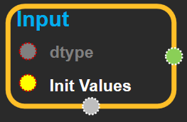
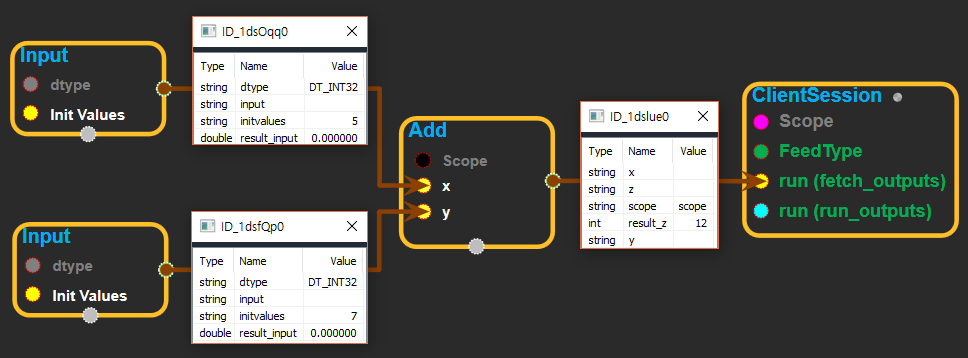
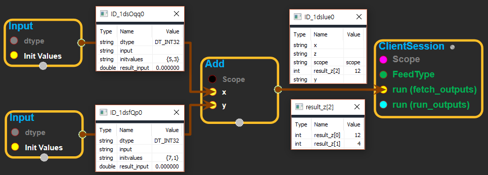

--- 
layout: default 
title: Input 
parent: core 
grand_parent: enuSpace-Tensorflow API 
last_modified_date: now 
--- 

# Input

---

## tensorflow C++ API

[tensorflow::Input](https://www.tensorflow.org/api_docs/cc/class/tensorflow/input.html)

Represents a tensor value that can be used as an operand to an[Operation](https://www.tensorflow.org/api_docs/cc/class/tensorflow/operation.html#classtensorflow_1_1_operation).

---

## Publicfunctions

### Input

```
Input(
  const Output & o
)
```

All of [Input](https://www.tensorflow.org/api_docs/cc/class/tensorflow/input.html#classtensorflow_1_1_input)'s constructors are implicit.

[Input](https://www.tensorflow.org/api_docs/cc/class/tensorflow/input.html#classtensorflow_1_1_input) can be implicitly constructed from the following objects :

* [Output](https://www.tensorflow.org/api_docs/cc/class/tensorflow/output.html#classtensorflow_1_1_output): This is so that the output of an [Operation](https://www.tensorflow.org/api_docs/cc/class/tensorflow/operation.html#classtensorflow_1_1_operation) can be directly used as the input to a op wrapper, which takes Inputs.
* A scalar, or a multi-dimensional tensor specified as a recursive initializer list. This enables directly passing constants as inputs to op wrappers.
* A [Tensor](https://www.tensorflow.org/api_docs/cc/class/tensorflow/tensor.html#classtensorflow_1_1_tensor) object.

### Input

```
 Input(
  const T & v
)
```

### Input

```
Input(
  const Initializer & init
)
```

### Input

```
 Input(
  const Tensor & t
)
```

### Input

```
Input(
  const std::initializer_list<Initializer>& init
)
```

### Input

```
 Input(
  const string & name,
  int32 i,
  DataType dt
)
```

Constructor specifying a node name, index and datatype.  
This should only be used for specifying a backward edge, needed by control flow.

### data\_type

```
DataType data_type() const
```

### index

```
int32 index() const
```

### node

```
Node * node() const
```

### node\_name

```
string node_name() const
```

### status

```
Status status() const
```

### tensor

```
const Tensor & tensor() const
```

---

## Inputblock

Source link :[https://github.com/EXPNUNI/enuSpaceTensorflow/blob/master/enuSpaceTensorflow/tf\_core.cpp](https://github.com/EXPNUNI/enuSpaceTensorflow/blob/master/enuSpaceTensorflow/tf_core.cpp)



Argument:

* Scope scope : A Scope object \(A scope is generated automatically each page. A scope is not connected.\)
* DataType `dtype`: Types of Input Variables. \( DT\_INT8, DT\_INT16, DT\_INT32,DT\_INT64, DT\_FLOAT, DT\_DOUBLE etc....\)
* Tensor `initvalue`: The value of the input variable. It can be written in python syntax. \(ex: {1,2} -&gt; shape: \[2\], input\[1\] = 1  input\[2\] = 2\)

Output:

* Input `input`: return Input type of tensor

---

## UsingMethod

※ Input 블럭에 dtype을 DT\_INT32로 동일하게 설정하고, Init Value 부분에 각각\(위에서 부터\) 5와 7을 넣어주고 실행한 뒤  Add블럭의 result\_z부분에 결과 값이 나온 화면

※ Input 블럭에 dtype을 DT\_INT32로 동일하게 설정하고, Init Value 부분에 각각 python에서 쓰는 shape 형태로\(위에서 부터\) {5, 3}와 {7, 1}을 넣어주고 실행한 뒤  Add블럭의 result\_z부분에 결과 값이 나온 화면

