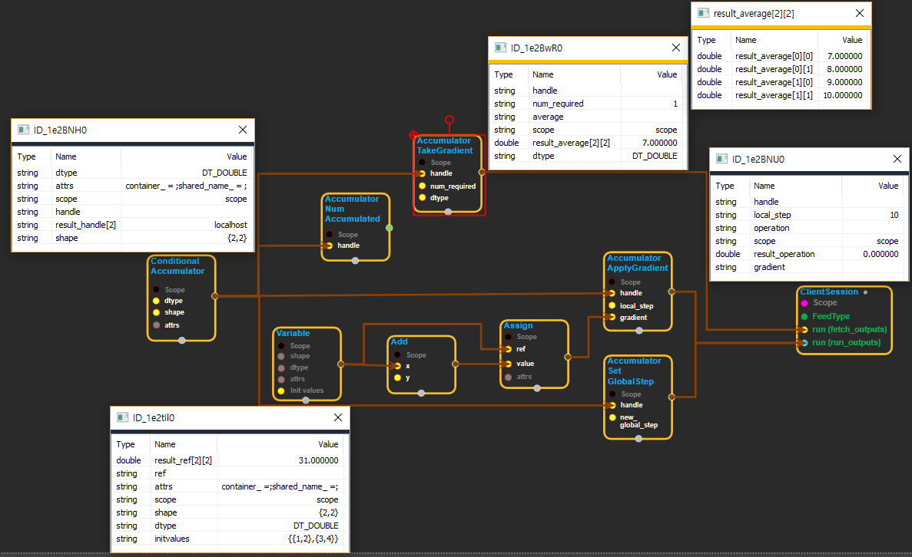

--- 
layout: default 
title: AccumulatorApplyGradient 
parent: data_flow_ops 
grand_parent: enuSpace-Tensorflow API 
last_modified_date: now 
--- 

# AccumulatorApplyGradient

---

## tensorflow C++ API

[tensorflow::ops::AccumulatorApplyGradient](https://www.tensorflow.org/api_docs/cc/class/tensorflow/ops/accumulator-apply-gradient)

Applies a gradient to a given accumulator.

---

## Summary

Does not add if local\_step is lesser than the accumulator's global\_step..

Arguments:

* scope: A Scope object
* handle: The handle to a accumulator.
* local\_step: The local\_step value at which the gradient was computed.
* gradient: A tensor of the gradient to be accumulated.

Returns:

* Output : the created Operation

Constructor

* AccumulatorApplyGradient\(const ::tensorflow::Scope & scope, ::tensorflow::Input handle, ::tensorflow::Input local\_step, ::tensorflow::Input gradient\).

Public attributes

* tensorflow::Operation operation.

---

## AccumulatorApplyGradient block

Source link : [https://github.com/EXPNUNI/enuSpace-Tensorflow/blob/master/enuSpaceTensorflow/tf\_data\_flow\_ops.cpp](https://github.com/EXPNUNI/enuSpace-Tensorflow/blob/master/enuSpaceTensorflow/tf_data_flow_ops.cpp)

Argument:

* Scope scope : A Scope object \(A scope is generated automatically each page. A scope is not connected.\)
* Input handle: connect Input node.
* Input  local\_step: connect Input node. 
* Input gradient : connect Input node.

Return:

* Operation  operation: Output operation of AccumulatorApplyGradient object.

Result:

* std::vector\(Tensor\) product\_result : Returned object of executed result by calling session.

---

## Using Method

