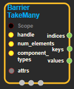

--- 
layout: default 
title: BarrierTakeMany 
parent: data_flow_ops 
grand_parent: enuSpace-Tensorflow API 
last_modified_date: now 
--- 

# BarrierTakeMany

---

## tensorflow C++ API

[tensorflow::ops::BarrierTakeMany](https://www.tensorflow.org/api_docs/cc/class/tensorflow/ops/barrier-take-many)

Takes the given number of completed elements from a barrier.

---

## Summary

This operation concatenates completed-element component tensors along the 0th dimension to make a single component tensor.

Elements come out of the barrier when they are complete, and in the order in which they were placed into the barrier. The indices output provides information about the batch in which each element was originally inserted into the barrier.

Arguments:

* scope: A Scope object
* handle: The handle to a barrier.
* num\_elements: A single-element tensor containing the number of elements to take.
* component\_types: The type of each component in a value.

Optional attributes \(see[`Attrs`](https://www.tensorflow.org/api_docs/cc/struct/tensorflow/ops/barrier-take-many/attrs.html#structtensorflow_1_1ops_1_1_barrier_take_many_1_1_attrs)\):

* allow\_small\_batch: Allow to return less than num\_elements items if barrier is already closed.
* timeout\_ms: If the queue is empty, this operation will block for up to timeout\_ms milliseconds. Note: This option is not supported yet.

Returns:

* `Output`indices: A one-dimensional tensor of indices, with length num\_elems. These indices refer to the batch in which the values were placed into the barrier \(starting with MIN\_LONG and increasing with each BarrierInsertMany\).
* `Output`keys: A one-dimensional tensor of keys, with length num\_elements.
* `OutputList`values: One any-dimensional tensor per component in a barrier element.All values have length num\_elements in the 0th dimension.

Constructor

* BarrierTakeMany\(const ::tensorflow::Scope & scope, ::tensorflow::Input handle, ::tensorflow::Input num\_elements, const DataTypeSlice & component\_types, const BarrierTakeMany::Attrs & attrs\).

Public attributes

* tensorflow::Output indices.
* tensorflow::Output keys.
* tensorflow::OutputList values.

---

## BarrierTakeMany block

Source link : [https://github.com/EXPNUNI/enuSpace-Tensorflow/blob/master/enuSpaceTensorflow/tf\_data\_flow\_ops.cpp](https://github.com/EXPNUNI/enuSpace-Tensorflow/blob/master/enuSpaceTensorflow/tf_data_flow_ops.cpp)

Argument:

* Scope scope : A Scope object \(A scope is generated automatically each page. A scope is not connected.\)
* Input handle : connect Input node.
* Input num\_elements: connect Input node.
* Input component\_types: connect Input node.

Return:

* Output  indices : Output object of BarrierTakeMany class object.
* Output  keys : Output object of BarrierTakeMany class object.
* OutputList  values: OutputList object of BarrierTakeMany class object.

Result:

* std::vector\(Tensor\) product\_result : Returned object of executed result by calling session.

---

## Using Method

