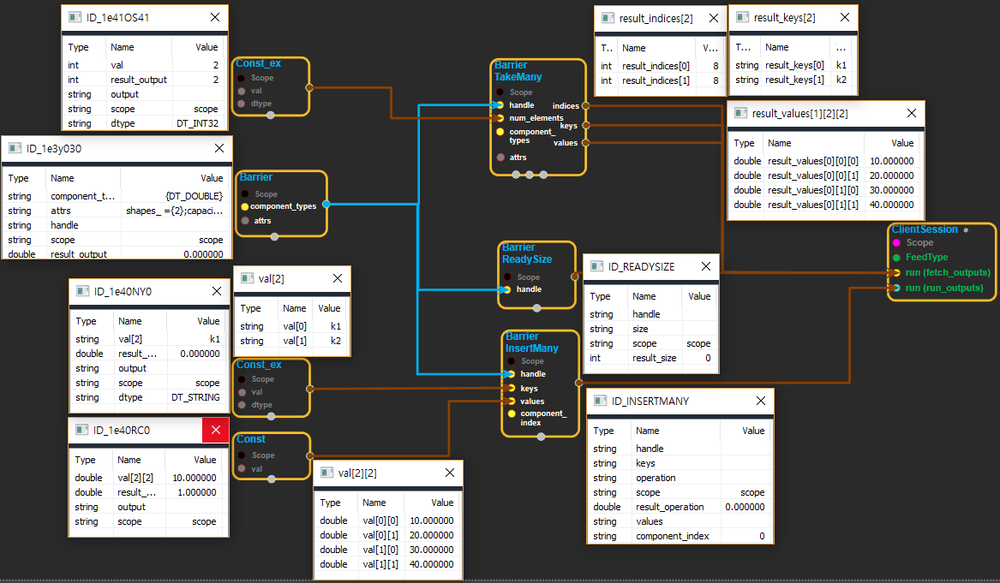

--- 
layout: default 
title: Barrier 
parent: data_flow_ops 
grand_parent: enuSpace-Tensorflow API 
last_modified_date: now 
--- 

# Barrier

---

## tensorflow C++ API

[tensorflow::ops::Barrier](https://www.tensorflow.org/api_docs/cc/class/tensorflow/ops/barrier)

Defines a barrier that persists across different graph executions.

---

## Summary

A barrier represents a key-value map, where each key is a string, and each value is a tuple of tensors.

At runtime, the barrier contains 'complete' and 'incomplete' elements. A complete element has defined tensors for all components of its value tuple, and may be accessed using BarrierTakeMany. An incomplete element has some undefined components in its value tuple, and may be updated using BarrierInsertMany.

Arguments:

* scope: A Scope object
* component\_types: The type of each component in a value.

Optional attributes \(see[`Attrs`](https://www.tensorflow.org/api_docs/cc/struct/tensorflow/ops/barrier/attrs.html#structtensorflow_1_1ops_1_1_barrier_1_1_attrs)\):

* shapes: The shape of each component in a value. Each shape must be 1 in the first dimension. The length of this attr must be the same as the length of component\_types.
* capacity: The capacity of the barrier. The default capacity is MAX\_INT32, which is the largest capacity of the underlying queue.
* container: If non-empty, this barrier is placed in the given container. Otherwise, a default container is used.
* shared\_name: If non-empty, this barrier will be shared under the given name across multiple sessions.

Returns:

* Output : The handle to the barrier.

Constructor

* Barrier\(const ::tensorflow::Scope & scope, const DataTypeSlice & component\_types, const Barrier::Attrs & attrs\).

Public attributes

* tensorflow::Output handle.

---

## Barrier block

Source link : [https://github.com/EXPNUNI/enuSpace-Tensorflow/blob/master/enuSpaceTensorflow/tf\_data\_flow\_ops.cpp](https://github.com/EXPNUNI/enuSpace-Tensorflow/blob/master/enuSpaceTensorflow/tf_data_flow_ops.cpp)

Argument:

* Scope scope : A Scope object \(A scope is generated automatically each page. A scope is not connected.\)
* DataType dtype : connect Input node or input DataType.ex\) DT\_DOUBLE;
* Barrier::Attrs attrs : input attrs data. ex\) shapes\_ ={2};capacity\_ = -1;container\_ = ;shared\_name\_ = ;

Return:

* Output handle: Output handle of Barrier class object.

Result:

* std::vector\(Tensor\) product\_result : Returned object of executed result by calling session.

---

## Using Method

