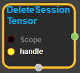

--- 
layout: default 
title: DeleteSessionTensor 
parent: data_flow_ops 
grand_parent: enuSpace-Tensorflow API 
last_modified_date: now 
--- 

# DeleteSessionTensor

---

## tensorflow C++ API

[tensorflow::ops::DeleteSessionTensor](https://www.tensorflow.org/api_docs/cc/class/tensorflow/ops/delete-session-tensor)

Delete the tensor specified by its handle in the session.

---

## Summary

Arguments:

* scope: A [Scope](https://www.tensorflow.org/api_docs/cc/class/tensorflow/scope.html#classtensorflow_1_1_scope) object
* handle: The handle for a tensor stored in the session state.

Returns:

* the created [`Operation`](https://www.tensorflow.org/api_docs/cc/class/tensorflow/operation.html#classtensorflow_1_1_operation)

---

## DeleteSessionTensor block

Source link : [https://github.com/EXPNUNI/enuSpace-Tensorflow/blob/master/enuSpaceTensorflow/tf\_data\_flow\_ops.cpp](https://github.com/EXPNUNI/enuSpace-Tensorflow/blob/master/enuSpaceTensorflow/tf_data_flow_ops.cpp)

Argument:

* Scope scope : A Scope object \(A scope is generated automatically each page. A scope is not connected.\)
* handle: The handle for a tensor stored in the session state.

Return:

* Operation handle: Output object of DeleteSessionTensor class object.

Result:

* std::vector\(Tensor\) product\_result : Returned object of executed result by calling session.

---

## Using Method

Issue : [https://github.com/tensorflow/tensorflow/issues/12901](https://github.com/tensorflow/tensorflow/issues/12901)

