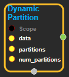

--- 
layout: default 
title: DynamicPartition 
parent: data_flow_ops 
grand_parent: enuSpace-Tensorflow API 
last_modified_date: now 
--- 

# DynamicPartition

---

## tensorflow C++ API

[tensorflow::ops::DynamicPartition](https://www.tensorflow.org/api_docs/cc/class/tensorflow/ops/dynamic-partition)

Partitions`data`into`num_partitions`tensors using indices from`partitions`.

---

## Summary

For each index tuple`js`of size`partitions.ndim`, the slice`data[js, ...]`becomes part of`outputs[partitions[js]]`. The slices with`partitions[js] = i`are placed in`outputs[i]`in lexicographic order of`js`, and the first dimension of`outputs[i]`is the number of entries in`partitions`equal to`i`. In detail,

\`\`\`python outputs\[i\].shape = \[sum\(partitions == i\)\] + data.shape\[partitions.ndim:\]

outputs\[i\] = pack\(\[data\[js, ...\] for js if partitions\[js\] == i\]\) \`\`\`

`data.shape`must start with`partitions.shape`.

For example:

\`\`\`python Scalar partitions.

partitions = 1 num\_partitions = 2 data = \[10, 20\] outputs\[0\] = \[\] \# Empty with shape \[0, 2\] outputs\[1\] = \[\[10, 20\]\]

Vector partitions.

partitions = \[0, 0, 1, 1, 0\] num\_partitions = 2 data = \[10, 20, 30, 40, 50\] outputs\[0\] = \[10, 20, 50\] outputs\[1\] = \[30, 40\] \`\`\`

See`dynamic_stitch`for an example on how to merge partitions back.

Arguments:

* scope: A [Scope](https://www.tensorflow.org/api_docs/cc/class/tensorflow/scope.html#classtensorflow_1_1_scope) object
* partitions: [Any](https://www.tensorflow.org/api_docs/cc/class/tensorflow/ops/any.html#classtensorflow_1_1ops_1_1_any) shape. Indices in the range`[0, num_partitions)`.
* num\_partitions: The number of partitions to output.

Returns:

* OutputList : The outputs tensor.

Constructor

* DynamicPartition\(const ::tensorflow::Scope & scope, ::tensorflow::Input data, ::tensorflow::Input partitions, int64 num\_partitions\).

Public attributes

* tensorflow::Output outputs.

---

## DynamicPartition block

Source link : [https://github.com/EXPNUNI/enuSpace-Tensorflow/blob/master/enuSpaceTensorflow/tf\_data\_flow\_ops.cpp](https://github.com/EXPNUNI/enuSpace-Tensorflow/blob/master/enuSpaceTensorflow/tf_data_flow_ops.cpp)

Argument:

* Scope scope : A Scope object \(A scope is generated automatically each page. A scope is not connected.\)
* data : connect  Input node or input data.
* partitions : connect  Input node or input int32 value.
* num\_partitions : connect  Input node or input int64 value.

Return:

* Output outputs: Output object of DynamicPartition class object.

Result:

* std::vector\(Tensor\) product\_result : Returned object of executed result by calling session.

---

## Using Method

