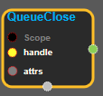
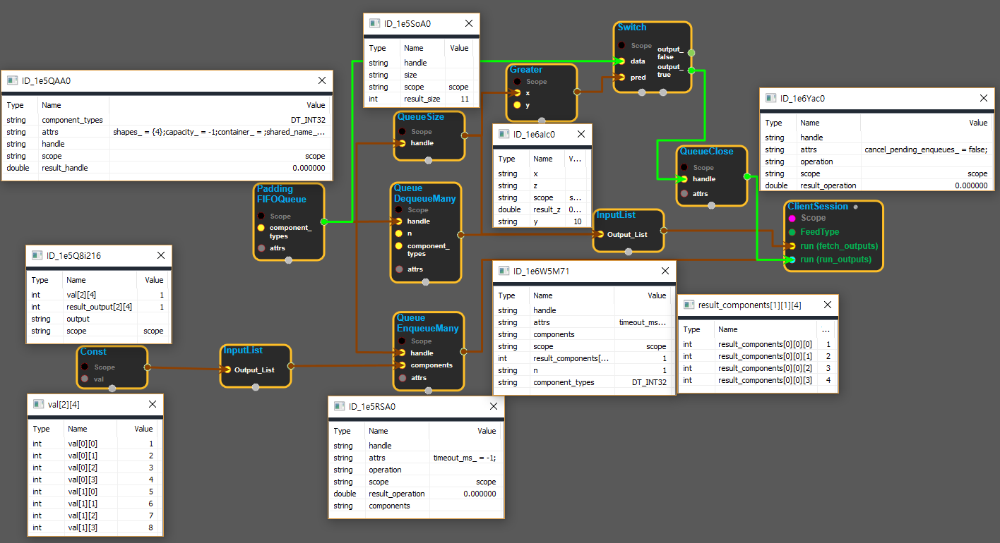

--- 
layout: default 
title: QueueClose 
parent: data_flow_ops 
grand_parent: enuSpace-Tensorflow API 
last_modified_date: now 
--- 

# QueueClose

---

## tensorflow C++ API

[tensorflow::ops::QueueClose](https://www.tensorflow.org/api_docs/cc/class/tensorflow/ops/queue-close)

Closes the given queue.

---

## Summary

This operation signals that no more elements will be enqueued in the given queue. Subsequent Enqueue\(Many\) operations will fail. Subsequent Dequeue\(Many\) operations will continue to succeed if sufficient elements remain in the queue. Subsequent Dequeue\(Many\) operations that would block will fail immediately.

Arguments:

* scope: A Scope object
* handle: The handle to a queue.

Returns:

* the created Operation.

Constructor

* QueueClose\(const ::tensorflow::Scope & scope, ::tensorflow::Input handle\).

Public attributes

* tensorflow::Operation operation.

---

## QueueClose block

Source link : [https://github.com/EXPNUNI/enuSpace-Tensorflow/blob/master/enuSpaceTensorflow/tf\_data\_flow\_ops.cpp](https://github.com/EXPNUNI/enuSpace-Tensorflow/blob/master/enuSpaceTensorflow/tf_data_flow_ops.cpp)

Argument:

* Scope scope : A Scope object \(A scope is generated automatically each page. A scope is not connected.\)
* Input handle : connect Input node.

Return:

* Operation operation: Output object of QueueClose  class object.

Result:

* std::vector\(Tensor\) product\_result : Returned object of executed result by calling session.

---

## Using Method

