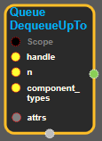
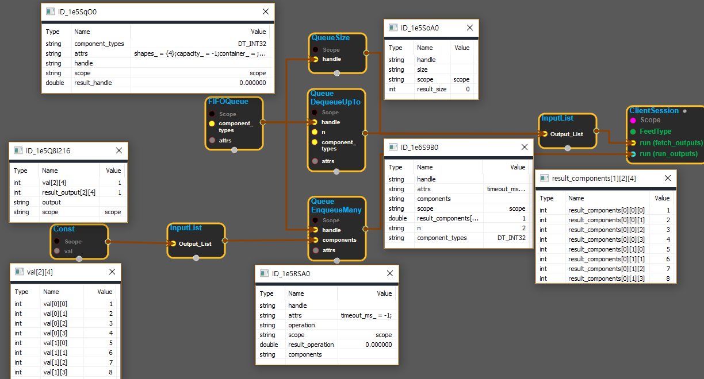

--- 
layout: default 
title: QueueDequeueUpTo 
parent: data_flow_ops 
grand_parent: enuSpace-Tensorflow API 
last_modified_date: now 
--- 

# QueueDequeuUpTo

---

## tensorflow C++ API

[tensorflow::ops::QueueDequeueMany](https://www.tensorflow.org/api_docs/cc/class/tensorflow/ops/queue-dequeue-up-to)

Dequeues n tuples of one or more tensors from the given queue.

---

## Summary

This operation is not supported by all queues. If a queue does not support DequeueUpTo, then an Unimplemented error is returned.

If the queue is closed and there are more than 0 but less than`n`elements remaining, then instead of returning an OutOfRange error like QueueDequeueMany, less than`n`elements are returned immediately. If the queue is closed and there are 0 elements left in the queue, then an OutOfRange error is returned just like in QueueDequeueMany. Otherwise the behavior is identical to QueueDequeueMany:

This operation concatenates queue-element component tensors along the 0th dimension to make a single component tensor.[All](https://www.tensorflow.org/api_docs/cc/class/tensorflow/ops/all.html#classtensorflow_1_1ops_1_1_all)of the components in the dequeued tuple will have size n in the 0th dimension.

This operation has k outputs, where k is the number of components in the tuples stored in the given queue, and output i is the ith component of the dequeued tuple.

Arguments:

* scope: A Scope object
* handle: The handle to a queue.
* n: The number of tuples to dequeue.
* component\_types: The type of each component in a tuple.

Optional attributes :

* timeout\_ms: If the queue is empty, this operation will block for up to timeout\_ms milliseconds. Note: This option is not supported yet.

Returns:

* OutputList : One or more tensors that were dequeued as a tuple.

Constructor

* QueueDequeueUpTo\(const ::tensorflow::Scope & scope, ::tensorflow::Input handle, ::tensorflow::Input n, const DataTypeSlice & component\_types\).

Public attributes

* tensorflow::OutputList components.

---

## QueueDequeueUpTo block

Source link : [https://github.com/EXPNUNI/enuSpace-Tensorflow/blob/master/enuSpaceTensorflow/tf\_data\_flow\_ops.cpp](https://github.com/EXPNUNI/enuSpace-Tensorflow/blob/master/enuSpaceTensorflow/tf_data_flow_ops.cpp)

Argument:

* Scope scope : A Scope object \(A scope is generated automatically each page. A scope is not connected.\)
* handle : connect  Input node.
* n : connect  Input node or Input int32 number.
* DataTypeSlice  component\_types : Input DataType list accordance with each Queued data.
* QueueDequeueUpTo::Attrs attrs : input attrs data. ex\) timeout\_ms= -1;

Return:

* OutputList components: Output object of QueueDequeueUpTo class object.

Result:

* std::vector\(Tensor\) product\_result : Returned object of executed result by calling session.

---

## Using Method

