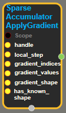

--- 
layout: default 
title: SparseAccumulatorApplyGradient 
parent: data_flow_ops 
grand_parent: enuSpace-Tensorflow API 
last_modified_date: now 
--- 

# SparseAccumulatorApplyGradient

---

## tensorflow C++ API

[tensorflow::ops::SparseAccumulatorApplyGradient](https://www.tensorflow.org/api_docs/cc/class/tensorflow/ops/sparse-accumulator-apply-gradient)

Applies a sparse gradient to a given accumulator.

---

## Summary

Does not add if local\_step is smaller than the accumulator's global\_step.

Arguments:

* scope: A Scope object
* handle: The handle to a accumulator.
* local\_step: The local\_step value at which the sparse gradient was computed.
* gradient\_indices: Indices of the sparse gradient to be accumulated. Must be a vector.
* gradient\_values: Values are the non-zero slices of the gradient, and must have the same first dimension as indices, i.e., the nnz represented by indices and values must be consistent.
* gradient\_shape: Shape of the sparse gradient to be accumulated.
* has\_known\_shape: Boolean indicating whether gradient\_shape is unknown, in which case the input is ignored during validation.

Returns:

* the created Operation 

Constructor

* SparseAccumulatorApplyGradient\(const ::tensorflow::Scope & scope, ::tensorflow::Input handle, ::tensorflow::Input local\_step, ::tensorflow::Input gradient\_indices, ::tensorflow::Input gradient\_values, ::tensorflow::Input gradient\_shape, bool has\_known\_shape\).

Public attributes

* tensorflow::Operation operation

---

## SparseAccumulatorApplyGradient block

Source link : [https://github.com/EXPNUNI/enuSpace-Tensorflow/blob/master/enuSpaceTensorflow/tf\_data\_flow\_ops.cpp](https://github.com/EXPNUNI/enuSpace-Tensorflow/blob/master/enuSpaceTensorflow/tf_data_flow_ops.cpp)

Argument:

* Scope scope : A Scope object \(A scope is generated automatically each page. A scope is not connected.\)
* handle : connect Input node.
* local\_step : connect Input node or input a int64 number.
* gradient\_indices : connect Input node.
* gradient\_values : connect Input node.
* gradient\_shape : connect Input node or input a shape. ex\) {5,2}.
* has\_known\_shape : connect Input node or input a bool data. ex\) true or false;

Return:

* Operation operation: Operation operation of SparseConditionalAccumulator class object.

Result:

* std::vector\(Tensor\) product\_result : Returned object of executed result by calling session.

---

## Using Method

