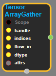
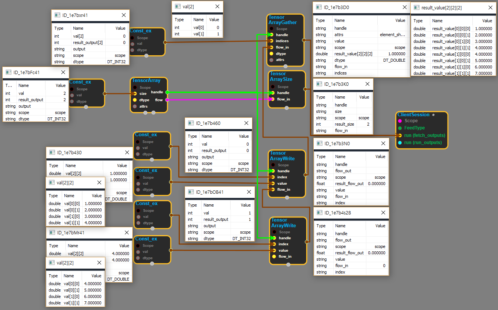

--- 
layout: default 
title: TensorArrayGather 
parent: data_flow_ops 
grand_parent: enuSpace-Tensorflow API 
last_modified_date: now 
--- 

# TensorArrayGather

---

## tensorflow C++ API

[tensorflow::ops::TensorArrayGather](https://www.tensorflow.org/api_docs/cc/class/tensorflow/ops/tensor-array-gather)

Gather specific elements from the TensorArray into output value.

---

## Summary

All elements selected by indices must have the same shape.

Arguments:

* scope: A Scope object
* handle: The handle to a TensorArray.
* indices: The locations in the TensorArray from which to read tensor elements.
* flow\_in: A float scalar that enforces proper chaining of operations.
* dtype: The type of the elem that is returned.

Optional attributes \(see[`Attrs`](https://www.tensorflow.org/api_docs/cc/struct/tensorflow/ops/tensor-array-concat/attrs.html#structtensorflow_1_1ops_1_1_tensor_array_concat_1_1_attrs)\):

* element\_shape: The expected shape of an element, if known. Used to validate the shapes of TensorArray elements. If this shape is not fully specified, gathering zero-size TensorArrays is an error.

Returns:

* Output value: All of the elements in the TensorArray , concatenated along a new axis \(the new dimension 0\).

Constructor

* TensorArrayGather\(const ::tensorflow::Scope & scope, ::tensorflow::Input handle, ::tensorflow::Input indices, ::tensorflow::Input flow\_in, DataType dtype, const TensorArrayGather::Attrs & attrs\).

Public attributes

* tensorflow::Output value.

---

## TensorArrayGather block

Source link : [https://github.com/EXPNUNI/enuSpace-Tensorflow/blob/master/enuSpaceTensorflow/tf\_data\_flow\_ops.cpp](https://github.com/EXPNUNI/enuSpace-Tensorflow/blob/master/enuSpaceTensorflow/tf_data_flow_ops.cpp)

Argument:

* Scope scope : A Scope object \(A scope is generated automatically each page. A scope is not connected.\)
* handle : connect Input node.
* indices : connect Input node or input indices array.
* flow\_in : connect Input node.
* DataType dtype : input datatype. ex\) DT\_DOUBLE
* TensorArrayGather::Attrs attrs : input attrs array. ex\) element\_shape={2,2}

Return:

* Output value : Output object of TensorArrayGather class object.

Result:

* std::vector\(Tensor\) product\_result : Returned object of executed result by calling session.

---

## Using Method

