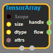
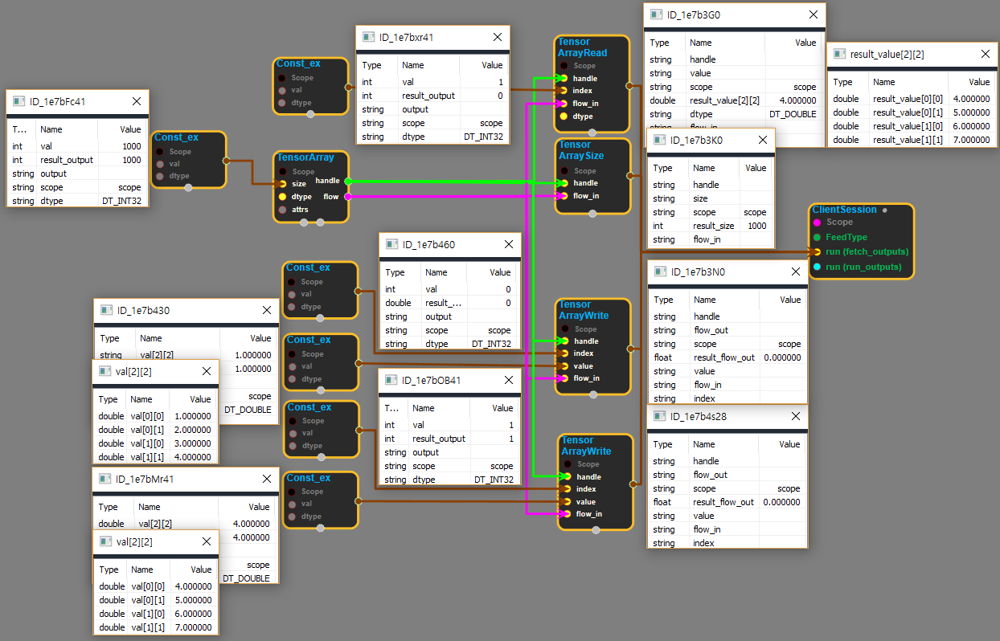

--- 
layout: default 
title: TensorArray 
parent: data_flow_ops 
grand_parent: enuSpace-Tensorflow API 
last_modified_date: now 
--- 

# TensorArray

---

## tensorflow C++ API

[tensorflow::ops::TensorArray](https://www.tensorflow.org/api_docs/cc/class/tensorflow/ops/tensor-array)

An array of Tensors of given size.

---

## Summary

Write data via Write and read via Read or Pack.

Arguments:

* scope: A Scope object
* size: The size of the array.
* dtype: The type of the elements on the tensor\_array.

Optional attributes \(see[`Attrs`](https://www.tensorflow.org/api_docs/cc/struct/tensorflow/ops/tensor-array/attrs.html#structtensorflow_1_1ops_1_1_tensor_array_1_1_attrs)\):

* element\_shape: The expected shape of an element, if known. Used to validate the shapes of TensorArray elements. If this shape is not fully specified, gathering zero-size TensorArrays is an error.
* dynamic\_size: A boolean that determines whether writes to the TensorArray are allowed to grow the size. By default, this is not allowed.
* clear\_after\_read: If true \(default\), Tensors in the TensorArray are cleared after being read. This disables multiple read semantics but allows early release of memory.
* tensor\_array\_name: Overrides the name used for the temporary tensor\_array resource. Default value is the name of the
  \`TensorArray' op \(which is guaranteed unique\).

Returns:

* Output handle: The handle to the TensorArray.
* Output flow: A scalar used to control gradient flow.

Constructor

* TensorArray\(const ::tensorflow::Scope & scope, ::tensorflow::Input size, DataType dtype, const TensorArray::Attrs & attrs\).

Public attributes

* tensorflow::Output flow.
* tensorflow::Output handle.

---

## TensorArray block

Source link : [https://github.com/EXPNUNI/enuSpace-Tensorflow/blob/master/enuSpaceTensorflow/tf\_data\_flow\_ops.cpp](https://github.com/EXPNUNI/enuSpace-Tensorflow/blob/master/enuSpaceTensorflow/tf_data_flow_ops.cpp)

Argument:

* Scope scope : A Scope object \(A scope is generated automatically each page. A scope is not connected.\)
* size : connect Input node or input array size.
* DataType dtype : input DataType. ex\) DT\_DOUBLE;
* TensorArray::Attrs attrs : input attrs data. ex\) element\_shape\_ = ; dynamic\_size\_ = false; clear\_after\_read\_ = true; tensor\_array\_name\_ =;

Return:

* Output flow: Output object of TensorArray class object.
* Output handle: Output handle of TensorArray class object.

Result:

* std::vector\(Tensor\) product\_result : Returned object of executed result by calling session.

---

## Using Method

