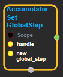
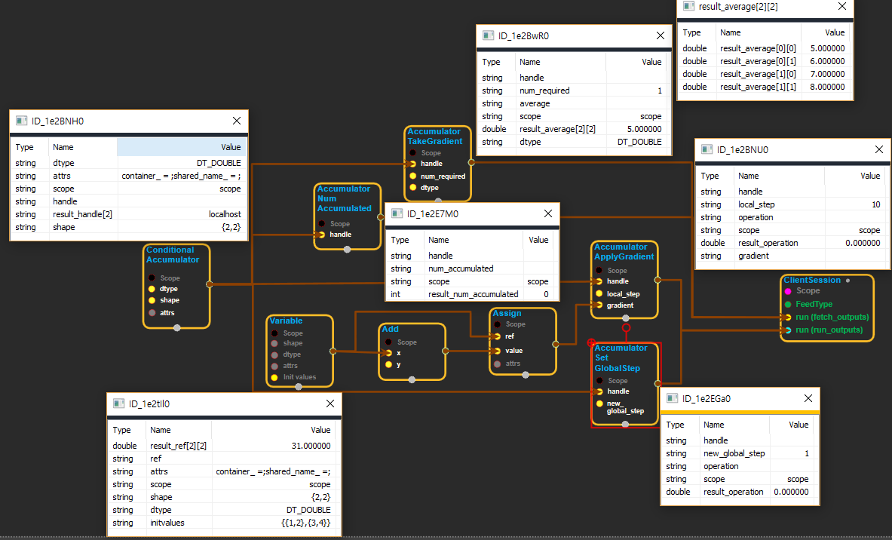

--- 
layout: default 
title: AccumulatorSetGlobalStep 
parent: data_flow_ops 
grand_parent: enuSpace-Tensorflow API 
last_modified_date: now 
--- 

# AccumulatorSetGlobalStep

---

## tensorflow C++ API

[tensorflow::ops::AccumulatorSetGlobalStep](https://www.tensorflow.org/api_docs/cc/class/tensorflow/ops/accumulator-set-global-step)

Updates the accumulator with a new value for global\_step.

---

## Summary

Logs warning if the accumulator's value is already higher than new\_global\_step.

Arguments:

* scope: A Scope object
* handle: The handle to an accumulator.
* new\_global\_step: The new global\_step value to set.

Returns:

* Output : the created Operation

Constructor

* AccumulatorSetGlobalStep\(const ::tensorflow::Scope & scope, ::tensorflow::Input handle, ::tensorflow::Input new\_global\_step\).

Public attributes

* tensorflow::Operation operation.

---

## AccumulatorSetGlobalStep block

Source link : [https://github.com/EXPNUNI/enuSpace-Tensorflow/blob/master/enuSpaceTensorflow/tf\_data\_flow\_ops.cpp](https://github.com/EXPNUNI/enuSpace-Tensorflow/blob/master/enuSpaceTensorflow/tf_data_flow_ops.cpp)

Argument:

* Scope scope : A Scope object \(A scope is generated automatically each page. A scope is not connected.\)
* Input handle: connect Input node.
* new\_global\_step : connect Input node.

Return:

* Operation operation.: Output operation of AccumulatorSetGlobalStep object.

Result:

* std::vector\(Tensor\) product\_result : Returned object of executed result by calling session.

---

## Using Method

