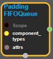
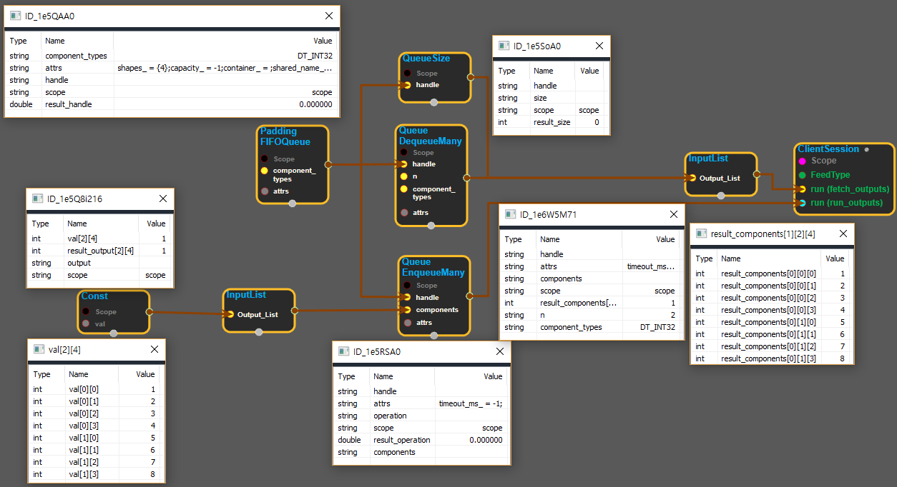

--- 
layout: default 
title: PaddingFifoQueue 
parent: data_flow_ops 
grand_parent: enuSpace-Tensorflow API 
last_modified_date: now 
--- 

# PaddingFIFOQueue

---

## tensorflow C++ API

[tensorflow::ops::PaddingFIFOQueue](https://www.tensorflow.org/api_docs/cc/class/tensorflow/ops/padding-f-i-f-o-queue)

A queue that produces elements in first-in first-out order.

---

## Summary

Variable-size shapes are allowed by setting the corresponding shape dimensions to 0 in the shape attr. In this case DequeueMany will pad up to the maximum size of any given element in the minibatch. See below for details.

Arguments:

* scope: A Scope object
* component\_types: The type of each component in a value.

Optional attributes \(see[`Attrs`](https://www.tensorflow.org/api_docs/cc/struct/tensorflow/ops/padding-f-i-f-o-queue/attrs.html#structtensorflow_1_1ops_1_1_padding_f_i_f_o_queue_1_1_attrs)\):

* shapes: The shape of each component in a value. The length of this attr must be either 0 or the same as the length of component\_types. Shapes of fixed rank but variable size are allowed by setting any shape dimension to -1. In this case, the inputs' shape may vary along the given dimension, and DequeueMany will pad the given dimension with zeros up to the maximum shape of all elements in the given batch. If the length of this attr is 0, different queue elements may have different ranks and shapes, but only one element may be dequeued at a time.
* capacity: The upper bound on the number of elements in this queue. Negative numbers mean no limit.
* container: If non-empty, this queue is placed in the given container. Otherwise, a default container is used.
* shared\_name: If non-empty, this queue will be shared under the given name across multiple sessions.

Returns:

* Output : The handle to the queue.

Constructor

* PaddingFIFOQueue\(const ::tensorflow::Scope & scope, const DataTypeSlice & component\_types, const PaddingFIFOQueue::Attrs & attrs\).

Public attributes

* tensorflow::Output handle.

---

## PaddingFIFOQueue block

Source link : [https://github.com/EXPNUNI/enuSpace-Tensorflow/blob/master/enuSpaceTensorflow/tf\_data\_flow\_ops.cpp](https://github.com/EXPNUNI/enuSpace-Tensorflow/blob/master/enuSpaceTensorflow/tf_data_flow_ops.cpp)

Argument:

* Scope scope : A Scope object \(A scope is generated automatically each page. A scope is not connected.\)
* component\_types: Input DataType list accordance with each input.
* PaddingFIFOQueue::Attrs attrs : input attrs data. ex\) shapes\_ = {}; capacity\_ = -1;container\_ = ""; shared\_name\_ = "";

Return:

* Output handle: Output object of PaddingFIFOQueue class object.

Result:

* std::vector\(Tensor\) product\_result : Returned object of executed result by calling session.

---

## Using Method

