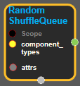
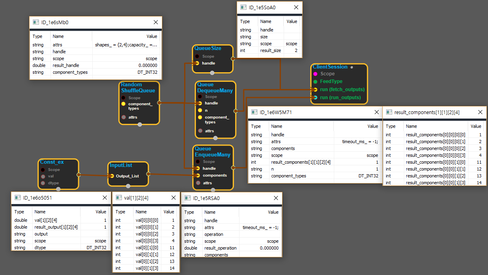

--- 
layout: default 
title: RandomShuffleQueue 
parent: data_flow_ops 
grand_parent: enuSpace-Tensorflow API 
last_modified_date: now 
--- 

# RandomShuffleQueue

---

## tensorflow C++ API

[tensorflow::ops::RandomShuffleQueue](https://www.tensorflow.org/api_docs/cc/class/tensorflow/ops/random-shuffle-queue)

A queue that randomizes the order of elements.

---

## Summary

Arguments:

* scope: A Scope object
* component\_types: The type of each component in a value.

Optional attributes \(see`Attrs`\):

* shapes: The shape of each component in a value. The length of this attr must be either 0 or the same as the length of component\_types. If the length of this attr is 0, the shapes of queue elements are not constrained, and only one element may be dequeued at a time.
* capacity: The upper bound on the number of elements in this queue. Negative numbers mean no limit.
* min\_after\_dequeue: Dequeue will block unless there would be this many elements after the dequeue or the queue is closed. This ensures a minimum level of mixing of elements.
* seed: If either seed or seed2 is set to be non-zero, the random number generator is seeded by the given seed. Otherwise, a random seed is used.
* seed2: A second seed to avoid seed collision.
* container: If non-empty, this queue is placed in the given container. Otherwise, a default container is used.
* shared\_name: If non-empty, this queue will be shared under the given name across multiple sessions.

Returns:

* Output : The handle to the queue.

Constructor

* RandomShuffleQueue\(const ::tensorflow::Scope & scope, const DataTypeSlice & component\_types, const RandomShuffleQueue::Attrs & attrs\).

Public attributes

* tensorflow::Output handle.

---

## RandomShuffleQueue block

Source link : [https://github.com/EXPNUNI/enuSpace-Tensorflow/blob/master/enuSpaceTensorflow/tf\_data\_flow\_ops.cpp](https://github.com/EXPNUNI/enuSpace-Tensorflow/blob/master/enuSpaceTensorflow/tf_data_flow_ops.cpp)

Argument:

* Scope scope : A Scope object \(A scope is generated automatically each page. A scope is not connected.\)
* component\_types: Input DataType List in accordance with each input.

* RandomShuffleQueue::Attrs attrs : input attrs data. ex\) shapes\_ = {2,4}_;  capacity = -1; container_ = ;  shared\_name = ;

Return:

* Output handle: Output object of RandomShuffleQueue class object.

Result:

* std::vector\(Tensor\) product\_result : Returned object of executed result by calling session.

---

## Using Method

