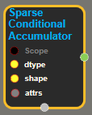
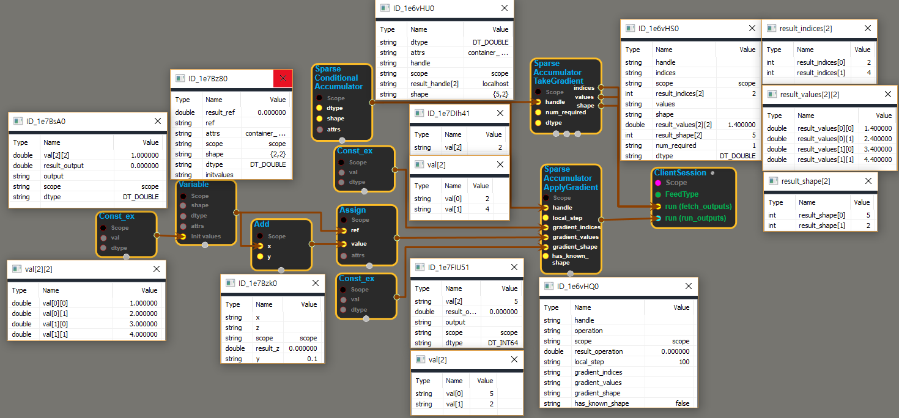

--- 
layout: default 
title: SparseConditionalAccumulator 
parent: data_flow_ops 
grand_parent: enuSpace-Tensorflow API 
last_modified_date: now 
--- 

# SparseConditionalAccumulator

---

## tensorflow C++ API

[tensorflow::ops::SparseConditionalAccumulator](https://www.tensorflow.org/api_docs/cc/class/tensorflow/ops/sparse-conditional-accumulator)

A conditional accumulator for aggregating sparse gradients.

---

## Summary

The accumulator accepts gradients marked with local\_step greater or equal to the most recent global\_step known to the accumulator. The average can be extracted from the accumulator, provided sufficient gradients have been accumulated. Extracting the average automatically resets the aggregate to 0, and increments the global\_step recorded by the accumulator.

Arguments:

* scope: A Scope object
* dtype: The type of the value being accumulated.
* shape: The shape of the values.

Optional attributes \(see[`Attrs`](https://www.tensorflow.org/api_docs/cc/struct/tensorflow/ops/f-i-f-o-queue/attrs.html#structtensorflow_1_1ops_1_1_f_i_f_o_queue_1_1_attrs)\):

* container: If non-empty, this queue is placed in the given container. Otherwise, a default container is used.
* shared\_name: If non-empty, this queue will be shared under the given name across multiple sessions.

Returns:

* Output : The handle to the accumulator.

Constructor

* SparseConditionalAccumulator\(const ::tensorflow::Scope & scope, DataType dtype, PartialTensorShape shape, const SparseConditionalAccumulator::Attrs & attrs\).

Public attributes

* tensorflow::Output handle.

---

## SparseConditionalAccumulator block

Source link : [https://github.com/EXPNUNI/enuSpace-Tensorflow/blob/master/enuSpaceTensorflow/tf\_data\_flow\_ops.cpp](https://github.com/EXPNUNI/enuSpace-Tensorflow/blob/master/enuSpaceTensorflow/tf_data_flow_ops.cpp)

Argument:

* Scope scope : A Scope object \(A scope is generated automatically each page. A scope is not connected.\)
* DataType dtype : connect Input node or input DataType.ex\) DT\_DOUBLE;
* PartialTensorShape shape : connect Input node or input PartialTensorShape .ex\) {2,2};
* SparseConditionalAccumulator::Attrs attrs : input attrs data. ex\) container\_ = ""; shared\_name\_ = "";

Return:

* Output handle: Output handle of SparseConditionalAccumulator class object.

Result:

* std::vector\(Tensor\) product\_result : Returned object of executed result by calling session.

---

## Using Method

