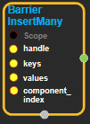

--- 
layout: default 
title: BarrierInsertMany 
parent: data_flow_ops 
grand_parent: enuSpace-Tensorflow API 
last_modified_date: now 
--- 

# BarrierInsertMany

---

## tensorflow C++ API

[tensorflow::ops::BarrierInsertMany](https://www.tensorflow.org/api_docs/cc/class/tensorflow/ops/barrier-insert-many)

For each key, assigns the respective value to the specified component.

---

## Summary

If a key is not found in the barrier, this operation will create a new incomplete element. If a key is found in the barrier, and the element already has a value at component\_index, this operation will fail with INVALID\_ARGUMENT, and leave the barrier in an undefined state.

Arguments:

* scope: A Scope object
* handle: The handle to a barrier.
* keys: A one-dimensional tensor of keys, with length n.
* values: An any-dimensional tensor of values, which are associated with the respective keys. The 0th dimension must have length n.
* component\_index: The component of the barrier elements that is being assigned.

Returns:

* the created Operation.

Constructor

* BarrierInsertMany\(const ::tensorflow::Scope & scope, ::tensorflow::Input handle, ::tensorflow::Input keys, ::tensorflow::Input values, int64 component\_index\).

Public attributes

* tensorflow::Operation operation.

---

## BarrierInsertMany block

Source link : [https://github.com/EXPNUNI/enuSpace-Tensorflow/blob/master/enuSpaceTensorflow/tf\_data\_flow\_ops.cpp](https://github.com/EXPNUNI/enuSpace-Tensorflow/blob/master/enuSpaceTensorflow/tf_data_flow_ops.cpp)

Argument:

* Scope scope : A Scope object \(A scope is generated automatically each page. A scope is not connected.\)
* Input handle : connect Input node.
* Input keys : connect Input node.
* Input values: connect Input node.
* Input component\_index: connect Input node.

Return:

* Operation operation: Operation operation of BarrierInsertMany class object.

Result:

* std::vector\(Tensor\) product\_result : Returned object of executed result by calling session.

---

## Using Method

