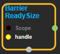
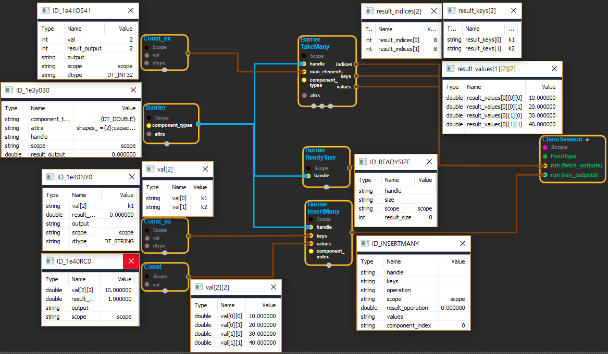

--- 
layout: default 
title: BarrierReadySize 
parent: data_flow_ops 
grand_parent: enuSpace-Tensorflow API 
last_modified_date: now 
--- 

# BarrierReadySize

---

## tensorflow C++ API

[tensorflow::ops::BarrierReadySize](https://www.tensorflow.org/api_docs/cc/class/tensorflow/ops/barrier-ready-size)

Computes the number of complete elements in the given barrier.

---

## Summary

Arguments:

* scope: A Scope object
* handle: The handle to a barrier.

Returns:

* Output : The number of complete elements \(i.e. those with all of their value components set\) in the barrier.

Constructor

* BarrierReadySize\(const ::tensorflow::Scope & scope, ::tensorflow::Input handle\).

Public attributes

* tensorflow::Output size.

---

## BarrierReadySize block

Source link : [https://github.com/EXPNUNI/enuSpace-Tensorflow/blob/master/enuSpaceTensorflow/tf\_data\_flow\_ops.cpp](https://github.com/EXPNUNI/enuSpace-Tensorflow/blob/master/enuSpaceTensorflow/tf_data_flow_ops.cpp)

Argument:

* Scope scope : A Scope object \(A scope is generated automatically each page. A scope is not connected.\)
* Input handle : connect Input node.

Return:

* Output  size: Output object of BarrierReadySize class object.

Result:

* std::vector\(Tensor\) product\_result : Returned object of executed result by calling session.

---

## Using Method

