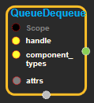
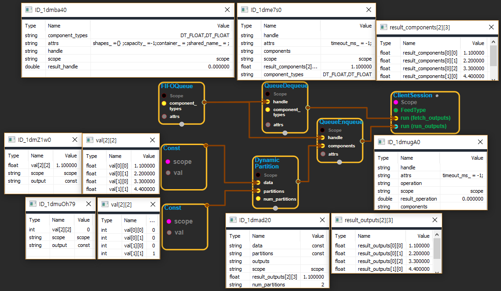

--- 
layout: default 
title: QueueDequeue 
parent: data_flow_ops 
grand_parent: enuSpace-Tensorflow API 
last_modified_date: now 
--- 

# QueueDequeue

---

## tensorflow C++ API

[tensorflow::ops::QueueDequeue](https://www.tensorflow.org/api_docs/cc/class/tensorflow/ops/queue-dequeue)

Dequeues a tuple of one or more tensors from the given queue.

---

## Summary

This operation has k outputs, where k is the number of components in the tuples stored in the given queue, and output i is the ith component of the dequeued tuple.

N.B. If the queue is empty, this operation will block until an element has been dequeued \(or 'timeout\_ms' elapses, if specified\).

Arguments:

* scope: A Scope object
* handle: The handle to a queue.
* component\_types: The type of each component in a tuple.

Optional attributes \(see[`Attrs`](https://www.tensorflow.org/api_docs/cc/struct/tensorflow/ops/queue-dequeue/attrs.html#structtensorflow_1_1ops_1_1_queue_dequeue_1_1_attrs)\):

* timeout\_ms: If the queue is empty, this operation will block for up to timeout\_ms milliseconds. Note: This option is not supported yet.

Returns:

* OutputList : One or more tensors that were dequeued as a tuple.

Constructor

* QueueDequeue\(const ::tensorflow::Scope & scope, ::tensorflow::Input handle, const DataTypeSlice & component\_types, const QueueDequeue::Attrs & attrs\) .

Public attributes

* tensorflow::OutputList components.

---

## QueueDequeue block

Source link : [https://github.com/EXPNUNI/enuSpace-Tensorflow/blob/master/enuSpaceTensorflow/tf\_data\_flow\_ops.cpp](https://github.com/EXPNUNI/enuSpace-Tensorflow/blob/master/enuSpaceTensorflow/tf_data_flow_ops.cpp)

Argument:

* Scope scope : A Scope object \(A scope is generated automatically each page. A scope is not connected.\)
* handle : connect  Input node.
* component\_types : Input DataType list accordance with each Queued data.
* QueueDequeue ::Attrs attrs : input attrs data. ex\) timeout\_ms= -1;

Return:

* OutputList components: Output object of QueueDequeue class object.

Result:

* std::vector\(Tensor\) product\_result : Returned object of executed result by calling session.

---

## Using Method

