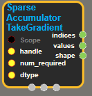
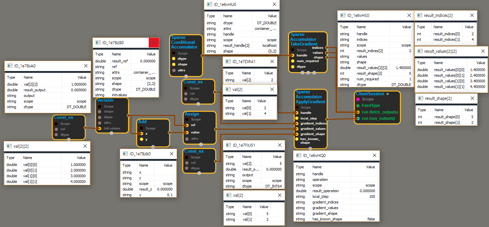

--- 
layout: default 
title: SparseAccumulatorTakeGradient 
parent: data_flow_ops 
grand_parent: enuSpace-Tensorflow API 
last_modified_date: now 
--- 

# SparseAccumulatorTakeGradient

---

## tensorflow C++ API

[tensorflow::ops::SparseAccumulatorTakeGradient](https://www.tensorflow.org/api_docs/cc/class/tensorflow/ops/sparse-accumulator-take-gradient)

Extracts the average sparse gradient in a SparseConditionalAccumulator.

---

## Summary

The op will blocks until sufficient \(i.e., more than num\_required\) gradients have been accumulated. If the accumulator has already aggregated more than num\_required gradients, it will return its average of the accumulated gradients. Also automatically increments the recorded global\_step in the accumulator by 1, and resets the aggregate to 0.

Arguments:

* scope: A Scope object
* handle: The handle to a SparseConditionalAccumulator.
* num\_required: Number of gradients required before we return an aggregate.
* dtype: The data type of accumulated gradients. Needs to correspond to the type of the accumulator.

Returns:

* `Output`indices: Indices of the average of the accumulated sparse gradients.
* `Output`values: Values of the average of the accumulated sparse gradients.
* `Output`shape: Shape of the average of the accumulated sparse gradients.

Constructor

* SparseAccumulatorTakeGradient\(const ::tensorflow::Scope & scope, ::tensorflow::Input handle, ::tensorflow::Input num\_required, DataType dtype\).

Public attributes

* tensorflow::Output indices.
* tensorflow::Output shape.
* tensorflow::Output values.

---

## SparseAccumulatorTakeGradient block

Source link : [https://github.com/EXPNUNI/enuSpace-Tensorflow/blob/master/enuSpaceTensorflow/tf\_data\_flow\_ops.cpp](https://github.com/EXPNUNI/enuSpace-Tensorflow/blob/master/enuSpaceTensorflow/tf_data_flow_ops.cpp)

Argument:

* Scope scope : A Scope object \(A scope is generated automatically each page. A scope is not connected.\)
* handle : connect Input node.
* num\_required : connect Input node or input a int64 number.
* DataType  dtype: connect Input node or input DataType. ex\) DT\_DOUBLE

Return:

* Operation operation: Operation operation of SparseAccumulatorTakeGradientclass object.

Result:

* std::vector\(Tensor\) product\_result : Returned object of executed result by calling session.

---

## Using Method

