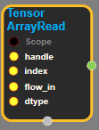
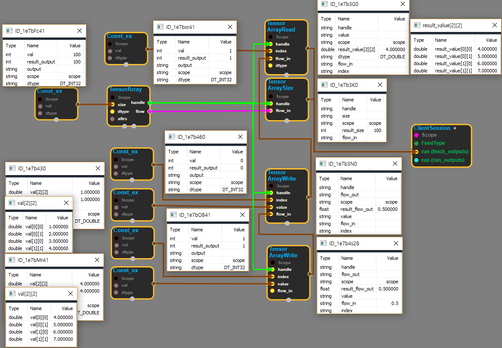

--- 
layout: default 
title: TensorArrayRead 
parent: data_flow_ops 
grand_parent: enuSpace-Tensorflow API 
last_modified_date: now 
--- 

# TensorArrayRead

---

## tensorflow C++ API

[tensorflow::ops::TensorArrayRead](https://www.tensorflow.org/api_docs/cc/class/tensorflow/ops/tensor-array-read)

Read an element from the TensorArray into output value.

---

## Summary

Arguments:

* scope: A Scope object
* handle: The handle to a TensorArray.
* flow\_in: A float scalar that enforces proper chaining of operations.
* dtype: The type of the elem that is returned.

Returns:

* Output : The tensor that is read from the TensorArray.

Constructor

* TensorArrayRead\(const ::tensorflow::Scope & scope, ::tensorflow::Input handle, ::tensorflow::Input index, ::tensorflow::Input flow\_in, DataType dtype\).

Public attributes

* tensorflow::Output flow\_out.

---

## TensorArrayRead block

Source link : [https://github.com/EXPNUNI/enuSpace-Tensorflow/blob/master/enuSpaceTensorflow/tf\_data\_flow\_ops.cpp](https://github.com/EXPNUNI/enuSpace-Tensorflow/blob/master/enuSpaceTensorflow/tf_data_flow_ops.cpp)

Argument:

* Scope scope : A Scope object \(A scope is generated automatically each page. A scope is not connected.\)
* handle : connect Input node.
* index : connect Input node or input index number.
* flow\_in : connect Input node.
* DataType dtype : input datatype. ex\) DT\_DOUBLE

Return:

* Output value: Output object of TensorArrayRead class object.

Result:

* std::vector\(Tensor\) product\_result : Returned object of executed result by calling session.

---

## Using Method

