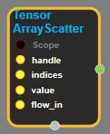
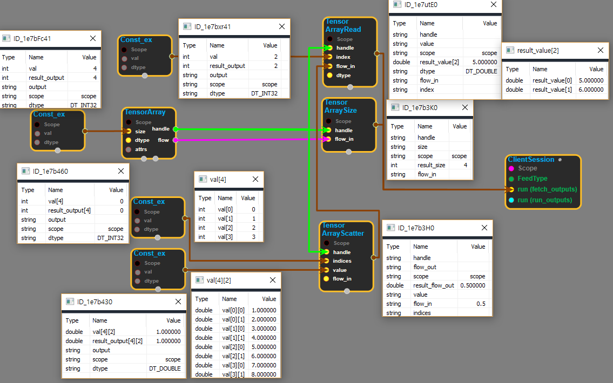

--- 
layout: default 
title: TensorArrayScatter 
parent: data_flow_ops 
grand_parent: enuSpace-Tensorflow API 
last_modified_date: now 
--- 

# TensorArrayScatter

---

## tensorflow C++ API

[tensorflow::ops::TensorArrayScatter](https://www.tensorflow.org/api_docs/cc/class/tensorflow/ops/tensor-array-scatter)

Scatter the data from the input value into specific TensorArray elements.

---

## Summary

Indices must be a vector, its length must match the first dim of value.

Arguments:

* scope: A Scope object
* handle: The handle to a TensorArray.
* indices: The locations at which to write the tensor elements.
* value: The tensor to write to the TensorArray.
* flow\_in: A float scalar that enforces proper chaining of operations.

Returns:

* Output : A float scalar that enforces proper chaining of operations.

Constructor

* TensorArrayScatter\(const ::tensorflow::Scope & scope, ::tensorflow::Input handle, ::tensorflow::Input indices, ::tensorflow::Input value, ::tensorflow::Input flow\_in\).

Public attributes

* tensorflow::Output flow\_out.

---

## TensorArrayScatter block

Source link : [https://github.com/EXPNUNI/enuSpace-Tensorflow/blob/master/enuSpaceTensorflow/tf\_data\_flow\_ops.cpp](https://github.com/EXPNUNI/enuSpace-Tensorflow/blob/master/enuSpaceTensorflow/tf_data_flow_ops.cpp)

Argument:

* Scope scope : A Scope object \(A scope is generated automatically each page. A scope is not connected.\)
* handle : connect Input node.
* indices : connect Input node or input indices vecter.
* value : connect Input node or input tensor value.
* flow\_in : connect Input node.

Return:

* Output flow\_out: Output object of TensorArrayScatter class object.

Result:

* std::vector\(Tensor\) product\_result : Returned object of executed result by calling session.

---

## Using Method

