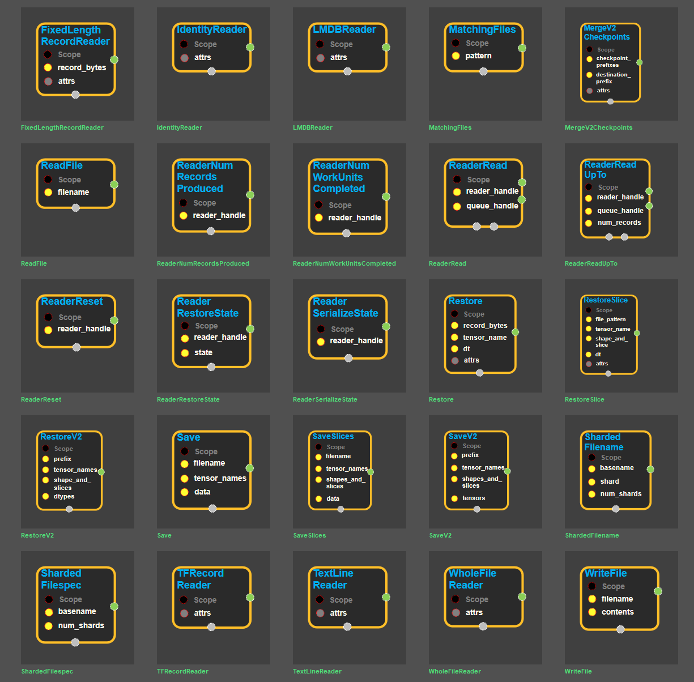

--- 
layout: default 
title: Io Ops 
parent: enuSpace-Tensorflow API 
has_children: true 
last_modified_date: now 
--- 

# Io Ops

## Summary

---

Source link : [https://github.com/EXPNUNI/enuSpaceTensorflow/blob/master/enuSpaceTensorflow/tf\_io\_ops.cpp](https://github.com/EXPNUNI/enuSpaceTensorflow/blob/master/enuSpaceTensorflow/tf_io_ops.cpp)

symbol block image 

