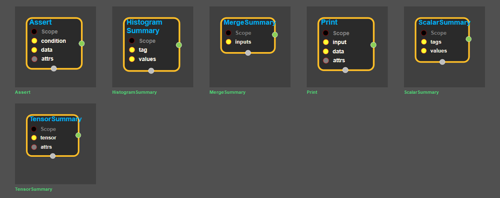

--- 
layout: default 
title: Logging Ops 
parent: enuSpace-Tensorflow API 
has_children: true 
last_modified_date: now 
--- 

# Logging Ops

## Summary

---

Source link : [https://github.com/EXPNUNI/enuSpaceTensorflow/blob/master/enuSpaceTensorflow/tf\_logging\_ops.cpp](https://github.com/EXPNUNI/enuSpaceTensorflow/blob/master/enuSpaceTensorflow/tf_logging_ops.cpp)

Logging Ops symbol block

Using Symbol block

