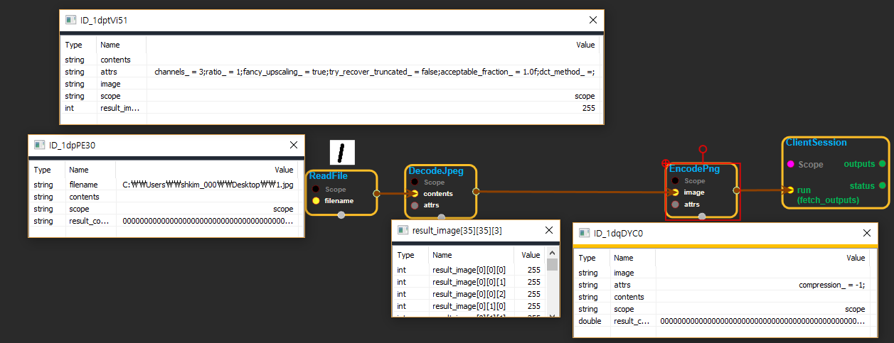

--- 
layout: default 
title: EncodePng 
parent: image_ops 
grand_parent: enuSpace-Tensorflow API 
last_modified_date: now 
--- 

# EncodePng

---

## tensorflow C++ API

[tensorflow::ops::EncodePng](https://www.tensorflow.org/api_docs/cc/class/tensorflow/ops/encode-png)

PNG-encode an image.

---

## Summary

`image`is a 3-D uint8 or uint16[Tensor](https://www.tensorflow.org/api_docs/cc/class/tensorflow/tensor.html#classtensorflow_1_1_tensor)of shape`[height, width, channels]`where`channels`is:

* 1: for grayscale.
* 2: for grayscale + alpha.
* 3: for RGB.
* 4: for RGBA.

The ZLIB compression level,`compression`, can be -1 for the PNG-encoder default or a value from 0 to 9. 9 is the highest compression level, generating the smallest output, but is slower.

Arguments:

* scope: A [Scope](https://www.tensorflow.org/api_docs/cc/class/tensorflow/scope.html#classtensorflow_1_1_scope) object
* image: 3-D with shape \[height, width, channels\].

Returns:

* [`Output`](https://www.tensorflow.org/api_docs/cc/class/tensorflow/output.html#classtensorflow_1_1_output): 0-D. JPEG-encoded image.

Optional attributes \(see[`Attrs`](https://www.tensorflow.org/api_docs/cc/struct/tensorflow/ops/encode-png/attrs.html#structtensorflow_1_1ops_1_1_encode_png_1_1_attrs)\):

* compression: Compression level.

Constructor

* EncodePng\(const ::tensorflow::Scope & scope, ::tensorflow::Input image, const EncodePng::Attrs & attrs\)  .

Public attributes

* tensorflow::Output contents.

---

## EncodePng block

Source link : [https://github.com/EXPNUNI/enuSpaceTensorflow/blob/master/enuSpaceTensorflow/tf\_image\_ops.cpp](https://github.com/EXPNUNI/enuSpaceTensorflow/blob/master/enuSpaceTensorflow/tf_image_ops.cpp)

Argument:

* Scope scope : A Scope object \(A scope is generated automatically each page. A scope is not connected.\)
* image: connect  Input node.
* EncodePng::Attrs attrs : input attrs value. ex\) compression\_ = -1;

Return:

* Output contents : Output object of EncodeJpeg class object.

Result:

* std::vector\(Tensor\) product\_result : Returned object of executed result by calling session.

---

## Using Method

