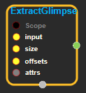
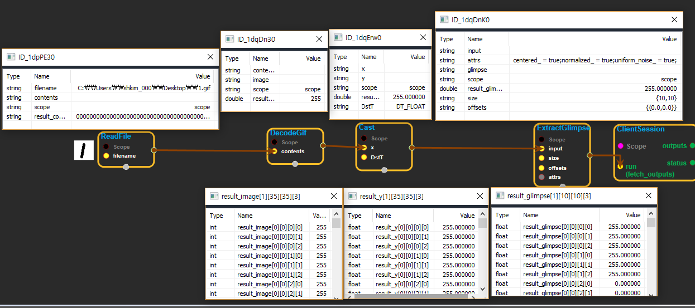

--- 
layout: default 
title: ExtractGlimpse 
parent: image_ops 
grand_parent: enuSpace-Tensorflow API 
last_modified_date: now 
--- 

# ExtractGlimpse

---

## tensorflow C++ API

[tensorflow::ops::ExtractGlimpse](https://www.tensorflow.org/api_docs/cc/class/tensorflow/ops/extract-glimpse)

Extracts a glimpse from the input tensor.

## Summary

Returns a set of windows called glimpses extracted at location`offsets`from the input tensor. If the windows only partially overlaps the inputs, the non overlapping areas will be filled with random noise.

The result is a 4-D tensor of shape`[batch_size, glimpse_height, glimpse_width, channels]`. The channels and batch dimensions are the same as that of the input tensor. The height and width of the output windows are specified in the`size`parameter.

The argument`normalized`and`centered`controls how the windows are built:

* If the coordinates are normalized but not centered, 0.0 and 1.0 correspond to the minimum and maximum of each height and width dimension.
* If the coordinates are both normalized and centered, they range from -1.0 to 1.0. The coordinates \(-1.0, -1.0\) correspond to the upper left corner, the lower right corner is located at \(1.0, 1.0\) and the center is at \(0, 0\).
* If the coordinates are not normalized they are interpreted as numbers of pixels.

Arguments:

* scope: A [Scope](https://www.tensorflow.org/api_docs/cc/class/tensorflow/scope.html#classtensorflow_1_1_scope) object.
* input: A 4-D float tensor of shape`[batch_size, height, width, channels]`.
* size: A 1-D tensor of 2 elements containing the size of the glimpses to extract. The glimpse height must be specified first, following by the glimpse width.
* offsets: A 2-D integer tensor of shape`[batch_size, 2]`containing the y, x locations of the center of each.

Optional attributes \(see[`Attrs`](https://www.tensorflow.org/api_docs/cc/struct/tensorflow/ops/extract-glimpse/attrs.html#structtensorflow_1_1ops_1_1_extract_glimpse_1_1_attrs)\):

* centered: indicates if the offset coordinates are centered relative to the image, in which case the \(0, 0\) offset is relative to the center of the input images. If false, the \(0,0\) offset corresponds to the upper left corner of the input images.
* normalized: indicates if the offset coordinates are normalized.
* uniform\_noise: indicates if the noise should be generated using a uniform distribution or a Gaussian distribution.

Returns:

* [`Output`](https://www.tensorflow.org/api_docs/cc/class/tensorflow/output.html#classtensorflow_1_1_output): A tensor representing the glimpses \[batch\_size, glimpse\_height, glimpse\_width, channels\].

Constructor

* ExtractGlimpse\(const ::tensorflow::Scope & scope, ::tensorflow::Input input, ::tensorflow::Input size, ::tensorflow::Input offsets, const ExtractGlimpse::Attrs & attrs\) .

Public attributes

* tensorflow::Output glimpse.

---

## ExtractGlimpse block

Source link : [https://github.com/EXPNUNI/enuSpaceTensorflow/blob/master/enuSpaceTensorflow/tf\_image\_ops.cpp](https://github.com/EXPNUNI/enuSpaceTensorflow/blob/master/enuSpaceTensorflow/tf_image_ops.cpp)

Argument:

* Scope scope : A Scope object \(A scope is generated automatically each page. A scope is not connected.\)
* input : connect  Input node.
* size : connect Input node or input int32 value.
* offsets : connect Input node or input float value. 
* ExtractGlimpse ::Attrs  attrs : input attrs. ex\) centered\_ = true;normalized\_ = true;uniform\_noise\_ = true;

Return:

* Output glimpse: Output object of ExtractGlimpse class object.

Result:

* std::vector\(Tensor\) product\_result : Returned object of executed result by calling session.

---

## Using Method

