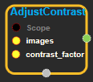
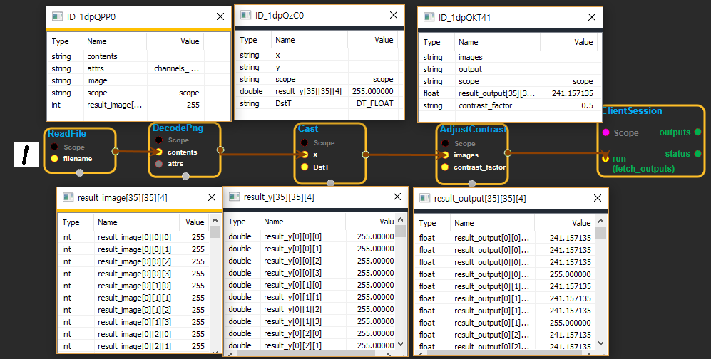

--- 
layout: default 
title: AdjustContrast 
parent: image_ops 
grand_parent: enuSpace-Tensorflow API 
last_modified_date: now 
--- 

# AdjustContrast

---

## tensorflow C++ API

[tensorflow::ops::AdjustContrast](https://www.tensorflow.org/api_docs/cc/class/tensorflow/ops/adjust-contrast)

Adjust the contrast of one or more images.

---

## Summary

`images`is a tensor of at least 3 dimensions. The last 3 dimensions are interpreted as`[height, width, channels]`. The other dimensions only represent a collection of images, such as`[batch, height, width, channels].`

Contrast is adjusted independently for each channel of each image.

For each channel, the Op first computes the mean of the image pixels in the channel and then adjusts each component of each pixel to`(x - mean) * contrast_factor + mean`.

Arguments:

* scope: A [Scope](https://www.tensorflow.org/api_docs/cc/class/tensorflow/scope.html#classtensorflow_1_1_scope) object
* images: Images to adjust. At least 3-D. **Datatype must be float.**
* contrast\_factor: A float multiplier for adjusting contrast.

Returns:

* [`Output`](https://www.tensorflow.org/api_docs/cc/class/tensorflow/output.html#classtensorflow_1_1_output): The contrast-adjusted image or images.

Constructor

* AdjustContrast\(const ::tensorflow::Scope & scope, ::tensorflow::Input images, ::tensorflow::Input contrast\_factor\).

Public attributes

* tensorflow::Output output.

---

## AdjustContrast block

Source link : [https://github.com/EXPNUNI/enuSpaceTensorflow/blob/master/enuSpaceTensorflow/tf\_image\_ops.cpp](https://github.com/EXPNUNI/enuSpaceTensorflow/blob/master/enuSpaceTensorflow/tf_image_ops.cpp)

Argument:

* Scope scope : A Scope object \(A scope is generated automatically each page. A scope is not connected.\)
* images : connect  Input node.
* contrast\_factor : connect  Input node or input float value.

Return:

* Output output: Output object of AdjustContrast class object.

Result:

* std::vector\(Tensor\) product\_result : Returned object of executed result by calling session.

---

## Using Method

Input contents datatype of images  must be float.

