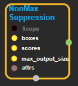
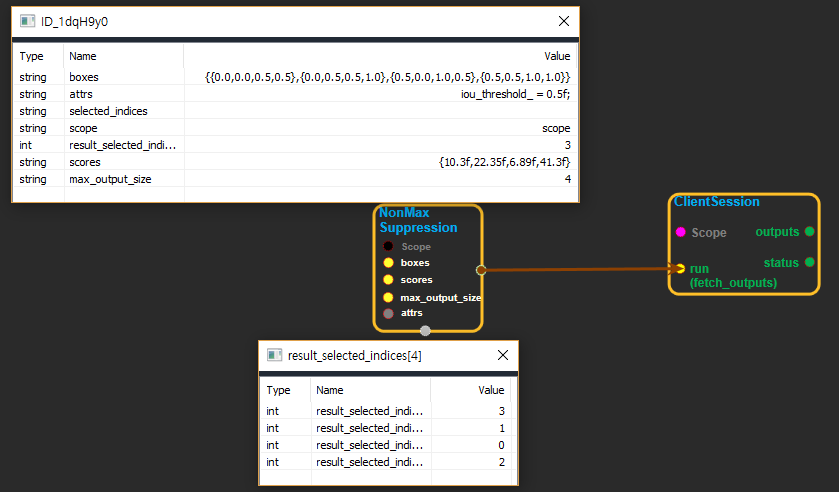

--- 
layout: default 
title: ExtractGlimpse 
parent: image_ops 
grand_parent: enuSpace-Tensorflow API 
last_modified_date: now 
--- 

# ExtractGlimpse

---

## tensorflow C++ API

[tensorflow::ops::ExtractGlimpse](https://www.tensorflow.org/api_docs/cc/class/tensorflow/ops/extract-glimpse)

Greedily selects a subset of bounding boxes in descending order of score, pruning away boxes that have high **intersection-over-union \(IOU\)** overlap with previously selected boxes.

## Summary

Bounding boxes are supplied as \[y1, x1, y2, x2\], where \(y1, x1\) and \(y2, x2\) are the coordinates of any diagonal pair of box corners and the coordinates can be provided as normalized \(i.e., lying in the interval \[0, 1\]\) or absolute. Note that this algorithm is agnostic to where the origin is in the coordinate system. Note that this algorithm is invariant to orthogonal transformations and translations of the coordinate system; thus translating or reflections of the coordinate system result in the same boxes being selected by the algorithm. The output of this operation is a set of integers indexing into the input collection of bounding boxes representing the selected boxes. The bounding box coordinates corresponding to the selected indices can then be obtained using the`tf.gather operation`. For example: selected\_indices = tf.image.non\_max\_suppression\( boxes, scores, max\_output\_size, iou\_threshold\) selected\_boxes = tf.gather\(boxes, selected\_indices\)

Arguments:

* scope: A [Scope](https://www.tensorflow.org/api_docs/cc/class/tensorflow/scope.html#classtensorflow_1_1_scope) object
* boxes: A 2-D float tensor of shape`[num_boxes, 4]`.
* scores: A 1-D float tensor of shape`[num_boxes]`representing a single score corresponding to each box \(each row of boxes\).
* max\_output\_size: A scalar integer tensor representing the maximum number of boxes to be selected by non max suppression.

Optional attributes \(see[`Attrs`](https://www.tensorflow.org/api_docs/cc/struct/tensorflow/ops/non-max-suppression/attrs.html#structtensorflow_1_1ops_1_1_non_max_suppression_1_1_attrs)\):

* iou\_threshold: A float representing the threshold for deciding whether boxes overlap too much with respect to IOU.

Returns:

* [`Output`](https://www.tensorflow.org/api_docs/cc/class/tensorflow/output.html#classtensorflow_1_1_output): A 1-D integer tensor of shape`[M]`representing the selected indices from the boxes tensor, where`M <= max_output_size`.

Constructor

* NonMaxSuppression\(const ::tensorflow::Scope & scope, ::tensorflow::Input boxes, ::tensorflow::Input scores, ::tensorflow::Input max\_output\_size, const NonMaxSuppression::Attrs & attrs\) 
  .

Public attributes

* tensorflow::Output selected\_indices.

---

## NonMaxSuppression block

Source link : [https://github.com/EXPNUNI/enuSpaceTensorflow/blob/master/enuSpaceTensorflow/tf\_image\_ops.cpp](https://github.com/EXPNUNI/enuSpaceTensorflow/blob/master/enuSpaceTensorflow/tf_image_ops.cpp)

Argument:

* Scope scope : A Scope object \(A scope is generated automatically each page. A scope is not connected.\)
* boxes: connect  Input node.
* scores: connect Input node or input int32 value.
* max\_output\_size: connect Input node or input float value. 
* NonMaxSuppression::Attrs  attrs : input attrs. ex\) iou\_threshold\_ = 0.5f;

Return:

* Output selected\_indices: Output object of NonMaxSuppression class object.

Result:

* std::vector\(Tensor\) product\_result : Returned object of executed result by calling session.

---

## Using Method

