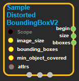
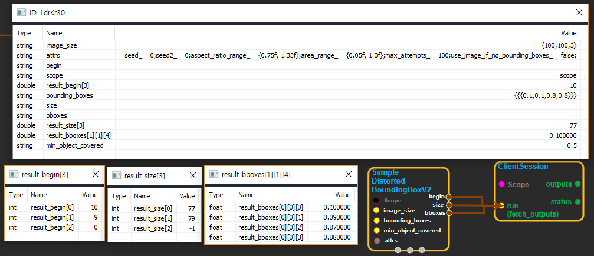

--- 
layout: default 
title: SampleDistortedBoundingBoxV2 
parent: image_ops 
grand_parent: enuSpace-Tensorflow API 
last_modified_date: now 
--- 

# SampleDistortedBoundingBoxV2

---

## tensorflow C++ API

[tensorflow::ops::SampleDistortedBoundingBoxV2](https://www.tensorflow.org/api_docs/cc/class/tensorflow/ops/sample-distorted-bounding-box-v2)

Generate a single randomly distorted bounding box for an image.

---

## Summary

Bounding box annotations are often supplied in addition to ground-truth labels in image recognition or object localization tasks. A common technique for training such a system is to randomly distort an image while preserving its content, i.e.data augmentation. This Op outputs a randomly distorted localization of an object, i.e. bounding box, given an `image_size`, `bounding_boxes `and a series of constraints.

The output of this Op is a single bounding box that may be used to crop the original image. The output is returned as 3 tensors:`begin`,`size`and`bboxes`. The first 2 tensors can be fed directly into `tf.slice `to crop the image. The latter may be supplied to `tf.image.draw_bounding_boxes `to visualize what the bounding box looks like.

Bounding boxes are supplied and returned as`[y_min, x_min, y_max, x_max]`. The bounding box coordinates are floats in`[0.0, 1.0]`relative to the width and height of the underlying image.

For example,

\`\`\`python Generate a single distorted bounding box.

begin, size, bbox\_for\_draw = tf.image.sample\_distorted\_bounding\_box\( tf.shape\(image\), bounding\_boxes=bounding\_boxes\)

Draw the bounding box in an image summary.

image\_with\_box = tf.image.draw\_bounding\_boxes\(tf.expand\_dims\(image, 0\), bbox\_for\_draw\) tf.image\_summary\('images\_with\_box', image\_with\_box\)

Employ the bounding box to distort the image.

distorted\_image = tf.slice\(image, begin, size\) \`\`\`

Note that if no bounding box information is available, setting`use_image_if_no_bounding_boxes = true`will assume there is a single implicit bounding box covering the whole image. If`use_image_if_no_bounding_boxes`is false and no bounding boxes are supplied, an error is raised.

Arguments:

* scope: A [Scope](https://www.tensorflow.org/api_docs/cc/class/tensorflow/scope.html#classtensorflow_1_1_scope) object
* image\_size: 1-D, containing \[height, width, channels\].
* bounding\_boxes: 3-D with shape \[batch, N, 4\] describing the N bounding boxes associated with the image.
* min\_object\_covered: The cropped area of the image must contain at least this fraction of any bounding box supplied. The value of this parameter should be non-negative. In the case of 0, the cropped area does not need to overlap any of the bounding boxes supplied.

Optional attributes \(see[`Attrs`](https://www.tensorflow.org/api_docs/cc/struct/tensorflow/ops/quantized-resize-bilinear/attrs.html#structtensorflow_1_1ops_1_1_quantized_resize_bilinear_1_1_attrs)\):

* seed: If eitherseedorseed2are set to non-zero, the random number generator is seeded by the givenseed. Otherwise, it is seeded by a random seed.
* seed2: A second seed to avoid seed collision.
  min\_object\_covered: The cropped area of the image must contain at least this fraction of any bounding box supplied. The value of this parameter should be non-negative. In the case of 0, the cropped area does not need to overlap any of the bounding boxes supplied.
* area\_range: The cropped area of the image must contain a fraction of the supplied image within in this range.
* max\_attempts: Number of attempts at generating a cropped region of the image of the specified constraints. After
  max\_attemptsfailures, return the entire image.
* use\_image\_if\_no\_bounding\_boxes: Controls behavior if no bounding boxes supplied. If true, assume an implicit bounding box covering the whole input. If false, raise an error.

Returns:

* [`Output`](https://www.tensorflow.org/api_docs/cc/class/tensorflow/output.html#classtensorflow_1_1_output)begin: 1-D, containing`[offset_height, offset_width, 0]`. Provide as input to`tf.slice`.
* [`Output`](https://www.tensorflow.org/api_docs/cc/class/tensorflow/output.html#classtensorflow_1_1_output)size: 1-D, containing`[target_height, target_width, -1]`. Provide as input to`tf.slice`.
* [`Output`](https://www.tensorflow.org/api_docs/cc/class/tensorflow/output.html#classtensorflow_1_1_output)bboxes: 3-D with shape`[1, 1, 4]`containing the distorted bounding box. Provide as input to`tf.image.draw_bounding_boxes`.

Constructor

* SampleDistortedBoundingBoxV2\(const ::tensorflow::Scope & scope, ::tensorflow::Input image\_size, ::tensorflow::Input bounding\_boxes, const SampleDistortedBoundingBox::Attrs & attrs\) .

Public attributes

* tensorflow::Output begin.
* tensorflow::Output size.
* tensorflow::Output bboxes.

---

## SampleDistortedBoundingBoxV2 block

Source link : [https://github.com/EXPNUNI/enuSpaceTensorflow/blob/master/enuSpaceTensorflow/tf\_image\_ops.cpp](https://github.com/EXPNUNI/enuSpaceTensorflow/blob/master/enuSpaceTensorflow/tf_image_ops.cpp)

Argument:

* Scope scope : A Scope object \(A scope is generated automatically each page. A scope is not connected.\)
* image\_size : connect  Input node or input int32 value.
* bounding\_boxes : connect Input node or input float value.
* min\_object\_covered : connect Input node or input float value.
* SampleDistortedBoundingBoxV2::Attrs  attrs : input attrs. ex\) seed\_ = 0;seed2\_ = 0;aspect\_ratio\_range\_ = {0.75f, 1.33f}; area\_range\_ = {0.05f, 1.0f};int64 max\_attempts\_ = 100;bool use\_image\_if\_no\_bounding\_boxes\_ = false;

Return:

* Output begin: Output object of SampleDistortedBoundingBoxV2 class object.
* Output size: Output object of SampleDistortedBoundingBoxV2 class object.
* Output bboxes: Output object of SampleDistortedBoundingBoxV2 class object.

Result:

* std::vector\(Tensor\) product\_result : Returned object of executed result by calling session.

---

## Using Method

