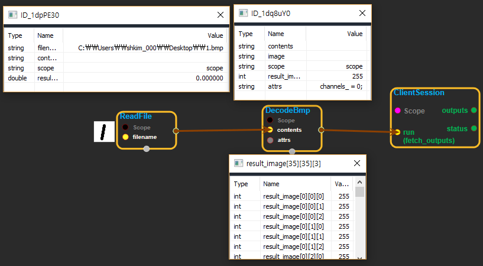

--- 
layout: default 
title: DecodeBmp 
parent: image_ops 
grand_parent: enuSpace-Tensorflow API 
last_modified_date: now 
--- 

# DecodeBmp

---

## tensorflow C++ API

[tensorflow::ops::DecodeBmp](https://www.tensorflow.org/api_docs/cc/class/tensorflow/ops/decode-bmp)

Decode the first frame of a BMP-encoded image to a uint8 tensor.

---

## Summary

The attr`channels`indicates the desired number of color channels for the decoded image.

Accepted values are:

* 0: Use the number of channels in the BMP-encoded image.
* 3: output an RGB image.
* 4: output an RGBA image.

Arguments:

* scope: A [Scope](https://www.tensorflow.org/api_docs/cc/class/tensorflow/scope.html#classtensorflow_1_1_scope) object
* contents: 0-D. The BMP-encoded image.

Returns:

* [`Output`](https://www.tensorflow.org/api_docs/cc/class/tensorflow/output.html#classtensorflow_1_1_output): 3-D with shape`[height, width, channels]`. RGB order

Constructor

* DecodeBmp\(const ::tensorflow::Scope & scope, ::tensorflow::Input contents, const DecodeBmp::Attrs & attrs\)  .

Public attributes

* tensorflow::Output image.

---

## DecodeBmp block

Source link : [https://github.com/EXPNUNI/enuSpaceTensorflow/blob/master/enuSpaceTensorflow/tf\_image\_ops.cpp](https://github.com/EXPNUNI/enuSpaceTensorflow/blob/master/enuSpaceTensorflow/tf_image_ops.cpp)

Argument:

* Scope scope : A Scope object \(A scope is generated automatically each page. A scope is not connected.\)
* contents : connect  Input node.
* DecodeBmp::Attrs attrs : input attrs value. ex\) channels\_ = 0;

Return:

* Output image: Output object of DecodeBmp class object.

Result:

* std::vector\(Tensor\) product\_result : Returned object of executed result by calling session.

---

## Using Method

