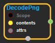
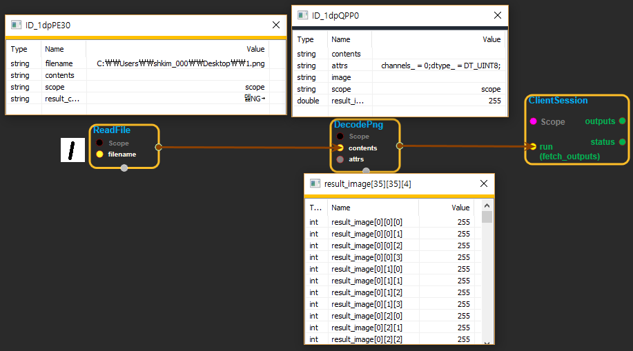

--- 
layout: default 
title: DecodePng 
parent: image_ops 
grand_parent: enuSpace-Tensorflow API 
last_modified_date: now 
--- 

# DecodePng

---

## tensorflow C++ API

[tensorflow::ops::DecodePng](https://www.tensorflow.org/api_docs/cc/class/tensorflow/ops/decode-png)

Decode a PNG-encoded image to a uint8 or uint16 tensor.

---

## Summary

The attr`channels`indicates the desired number of color channels for the decoded image.

Accepted values are:

* 0: Use the number of channels in the PNG-encoded image.
* 1: output a grayscale image.
* 3: output an RGB image.
* 4: output an RGBA image.

If needed, the PNG-encoded image is transformed to match the requested number of color channels.

This op also supports decoding JPEGs and non-animated GIFs since the interface is the same, though it is cleaner to use`tf.image.decode_image`.

Arguments:

* scope: A [Scope](https://www.tensorflow.org/api_docs/cc/class/tensorflow/scope.html#classtensorflow_1_1_scope) object
* contents: 0-D. The PNG-encoded image.

Optional attributes \(see[`Attrs`](https://www.tensorflow.org/api_docs/cc/struct/tensorflow/ops/decode-png/attrs.html#structtensorflow_1_1ops_1_1_decode_png_1_1_attrs)\):

* channels: Number of color channels for the decoded image.

Returns:

* [`Output`](https://www.tensorflow.org/api_docs/cc/class/tensorflow/output.html#classtensorflow_1_1_output): 3-D with shape`[height, width, channels]`.

Constructor

* DecodePng\(const ::tensorflow::Scope & scope, ::tensorflow::Input contents, const DecodePng::Attrs & attrs\).

Public attributes

* tensorflow::Output output.

---

## DecodePng block

Source link : [https://github.com/EXPNUNI/enuSpaceTensorflow/blob/master/enuSpaceTensorflow/tf\_image\_ops.cpp](https://github.com/EXPNUNI/enuSpaceTensorflow/blob/master/enuSpaceTensorflow/tf_image_ops.cpp)

Argument:

* Scope scope : A Scope object \(A scope is generated automatically each page. A scope is not connected.\)
* contents: connect  Input node.
* DecodePng::Attrs attrs :  input attrs value. ex\) channels\_ = 0;   dtype\_ = DT\_UINT8;

Return:

* Output image : Output object of DecodePng class object.

Result:

* std::vector\(Tensor\) product\_result : Returned object of executed result by calling session.

---

## Using Method

