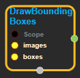
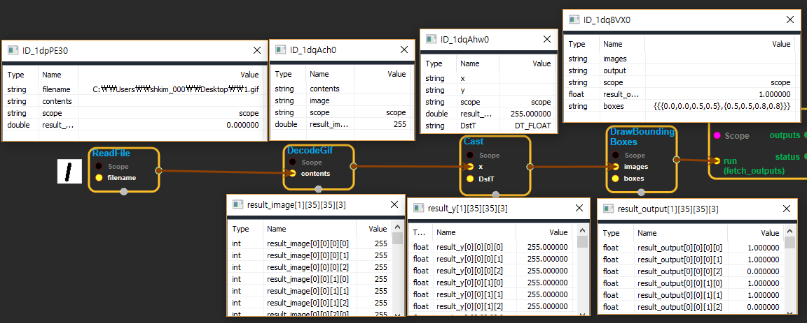

--- 
layout: default 
title: DrawBoundingBoxes 
parent: image_ops 
grand_parent: enuSpace-Tensorflow API 
last_modified_date: now 
--- 

# DrawBoundingBoxes

---

## tensorflow C++ API

[tensorflow::ops::DrawBoundingBoxes](https://www.tensorflow.org/api_docs/cc/class/tensorflow/ops/draw-bounding-boxes)

Draw bounding boxes on a batch of images.

---

## Summary

Outputs a copy of`images`but draws on top of the pixels zero or more bounding boxes specified by the locations in`boxes`. The coordinates of the each bounding box in`boxes`are encoded as`[y_min, x_min, y_max, x_max]`. The bounding box coordinates are floats in`[0.0, 1.0]`relative to the width and height of the underlying image.

For example, if an image is 100 x 200 pixels and the bounding box is`[0.1, 0.2, 0.5, 0.9]`, the bottom-left and upper-right coordinates of the bounding box will be`(10, 40)`to`(50, 180)`.

Parts of the bounding box may fall outside the image.

Arguments:

* scope: A [Scope](https://www.tensorflow.org/api_docs/cc/class/tensorflow/scope.html#classtensorflow_1_1_scope) object
* images: 4-D with shape`[batch, height, width, depth]`. A batch of images.
* boxes: 3-D with shape`[batch, num_bounding_boxes, 4]`containing bounding boxes. float.

Returns:

* [`Output`](https://www.tensorflow.org/api_docs/cc/class/tensorflow/output.html#classtensorflow_1_1_output): 4-D with the same shape as`images`. The batch of input images with bounding boxes drawn on the images.

Constructor

* DrawBoundingBoxes\(const ::tensorflow::Scope & scope, ::tensorflow::Input images, ::tensorflow::Input boxes\)   .

Public attributes

* tensorflow::Output image.

---

## DrawBoundingBoxes block

Source link : [https://github.com/EXPNUNI/enuSpaceTensorflow/blob/master/enuSpaceTensorflow/tf\_image\_ops.cpp](https://github.com/EXPNUNI/enuSpaceTensorflow/blob/master/enuSpaceTensorflow/tf_image_ops.cpp)

Argument:

* Scope scope : A Scope object \(A scope is generated automatically each page. A scope is not connected.\)
* images: connect  Input node.
* boxes : connect  Input node or input 3 dimensions float value. ex\) channels\_ = 0;

Return:

* Output output: Output object of DrawBoundingBoxes class object.

Result:

* std::vector\(Tensor\) product\_result : Returned object of executed result by calling session.

---

## Using Method

