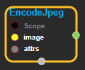
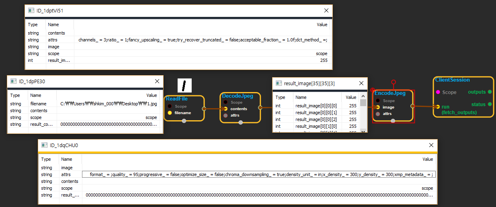

--- 
layout: default 
title: EncodeJpeg 
parent: image_ops 
grand_parent: enuSpace-Tensorflow API 
last_modified_date: now 
--- 

# EncodeJpeg

---

## tensorflow C++ API

[tensorflow::ops::EncodeJpeg](https://www.tensorflow.org/api_docs/cc/class/tensorflow/ops/encode-jpeg)

JPEG-encode an image.

---

## Summary

`image`is a 3-D uint8[Tensor](https://www.tensorflow.org/api_docs/cc/class/tensorflow/tensor.html#classtensorflow_1_1_tensor)of shape`[height, width, channels]`.The attr`format`can be used to override the color format of the encoded output. Values can be:

` Use a default format based on the number of channels in the image. *`grayscale`:`[`Output`](https://www.tensorflow.org/api_docs/cc/class/tensorflow/output.html#classtensorflow_1_1_output)`a grayscale JPEG image. The`channels`dimension of`image`must be 1. *`rgb`:`[`Output`](https://www.tensorflow.org/api_docs/cc/class/tensorflow/output.html#classtensorflow_1_1_output)`an RGB JPEG image. The`channels`dimension of`image\` must be 3.

If`format`is not specified or is the empty string, a default format is picked in function of the number of channels in`image`:

* 1:[Output](https://www.tensorflow.org/api_docs/cc/class/tensorflow/output.html#classtensorflow_1_1_output) a grayscale image.
* 3:[Output](https://www.tensorflow.org/api_docs/cc/class/tensorflow/output.html#classtensorflow_1_1_output) an RGB image.

Arguments:

* scope: A [Scope](https://www.tensorflow.org/api_docs/cc/class/tensorflow/scope.html#classtensorflow_1_1_scope) object
* image: 3-D with shape \[height, width, channels\].

Returns:

* [`Output`](https://www.tensorflow.org/api_docs/cc/class/tensorflow/output.html#classtensorflow_1_1_output): 0-D. JPEG-encoded image.

Optional attributes \(see[`Attrs`](https://www.tensorflow.org/api_docs/cc/struct/tensorflow/ops/encode-jpeg/attrs.html#structtensorflow_1_1ops_1_1_encode_jpeg_1_1_attrs)\):

* format: Per pixel image format.
* quality: Quality of the compression from 0 to 100 \(higher is better and slower\).
* progressive: If True, create a JPEG that loads progressively \(coarse to fine\).
* optimize\_size: If True, spend CPU/RAM to reduce size with no quality change.
* chroma\_downsampling: See [http://en.wikipedia.org/wiki/Chroma\_subsampling](http://en.wikipedia.org/wiki/Chroma_subsampling).
* density\_unit: Unit used to specify`x_density`and`y_density`: pixels per inch \(`'in'`\) or centimeter \(`'cm'`\).
* x\_density: Horizontal pixels per density unit.
* y\_density: Vertical pixels per density unit.
* xmp\_metadata: If not empty, embed this XMP metadata in the image header.

Constructor

* EncodeJpeg\(const ::tensorflow::Scope & scope, ::tensorflow::Input image, const EncodeJpeg::Attrs & attrs\)  .

Public attributes

* tensorflow::Output contents.

---

## EncodeJpeg block

Source link : [https://github.com/EXPNUNI/enuSpaceTensorflow/blob/master/enuSpaceTensorflow/tf\_image\_ops.cpp](https://github.com/EXPNUNI/enuSpaceTensorflow/blob/master/enuSpaceTensorflow/tf_image_ops.cpp)

Argument:

* Scope scope : A Scope object \(A scope is generated automatically each page. A scope is not connected.\)
* image: connect  Input node.
* EncodeJpeg::Attrs attrs : input attrs value. ex\) format\_ = ;quality\_ = 95;progressive\_ = false;optimize\_size\_ = false;chroma\_downsampling\_ = true;density\_unit\_ = in;x\_density\_ = 300;y\_density\_ = 300;xmp\_metadata\_ = ;

Return:

* Output contents : Output object of EncodeJpeg class object.

Result:

* std::vector\(Tensor\) product\_result : Returned object of executed result by calling session.

---

## Using Method

