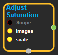

--- 
layout: default 
title: AdjustSaturation 
parent: image_ops 
grand_parent: enuSpace-Tensorflow API 
last_modified_date: now 
--- 

# AdjustSaturation

---

## tensorflow C++ API

[tensorflow::ops::AdjustSaturation](https://www.tensorflow.org/api_docs/cc/class/tensorflow/ops/adjust-saturation)

Adjust the saturation of one or more images.

---

## Summary

`images`is a tensor of at least 3 dimensions. The last dimension is interpretted as channels, and must be three.

The input image is considered in the RGB colorspace. Conceptually, the RGB colors are first mapped into HSV. A scale is then applied all the saturation values, and then remapped back to RGB colorspace.

Arguments:

* scope: A [Scope](https://www.tensorflow.org/api_docs/cc/class/tensorflow/scope.html#classtensorflow_1_1_scope) object
* images: Images to adjust. At least 3-D.. **Datatype must be float.**
* scale: A float delta to add to the saturation.

Returns:

* [`Output`](https://www.tensorflow.org/api_docs/cc/class/tensorflow/output.html#classtensorflow_1_1_output): The saturation-adjusted image or images.

Constructor

* AdjustSaturation\(const ::tensorflow::Scope & scope, ::tensorflow::Input images, ::tensorflow::Input scale\) .

Public attributes

* tensorflow::Output output.

---

## AdjustSaturation block

Source link : [https://github.com/EXPNUNI/enuSpaceTensorflow/blob/master/enuSpaceTensorflow/tf\_image\_ops.cpp](https://github.com/EXPNUNI/enuSpaceTensorflow/blob/master/enuSpaceTensorflow/tf_image_ops.cpp)

Argument:

* Scope scope : A Scope object \(A scope is generated automatically each page. A scope is not connected.\)
* images : connect  Input node.
* scale: connect  Input node or input float value.

Return:

* Output output: Output object of AdjustSaturation class object.

Result:

* std::vector\(Tensor\) product\_result : Returned object of executed result by calling session.

---

## Using Method

Input contents datatype of images  must be float.

