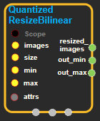

--- 
layout: default 
title: QuantizedResizeBilinear 
parent: image_ops 
grand_parent: enuSpace-Tensorflow API 
last_modified_date: now 
--- 

# QuantizedResizeBilinear

---

## tensorflow C++ API

[tensorflow::ops::QuantizedResizeBilinear](https://www.tensorflow.org/api_docs/cc/class/tensorflow/ops/quantized-resize-bilinear)

Resize quantized`images`to`size`using quantized bilinear interpolation.

---

## Summary

[Input](https://www.tensorflow.org/api_docs/cc/class/tensorflow/input.html#classtensorflow_1_1_input)

images and output images must be quantized types.

Arguments:

* scope: A [Scope](https://www.tensorflow.org/api_docs/cc/class/tensorflow/scope.html#classtensorflow_1_1_scope) object
* images: 4-D with shape`[batch, height, width, channels]`.
* size: = A 1-D int32 [Tensor](https://www.tensorflow.org/api_docs/cc/class/tensorflow/tensor.html#classtensorflow_1_1_tensor) of 2 elements:`new_height, new_width`. The new size for the images.

Optional attributes \(see[`Attrs`](https://www.tensorflow.org/api_docs/cc/struct/tensorflow/ops/quantized-resize-bilinear/attrs.html#structtensorflow_1_1ops_1_1_quantized_resize_bilinear_1_1_attrs)\):

* align\_corners: If true, rescale input by \(new\_height - 1\) / \(height - 1\), which exactly aligns the 4 corners of images and resized images. If false, rescale by new\_height / height. Treat similarly the width dimension.

Returns:

* [`Output`](https://www.tensorflow.org/api_docs/cc/class/tensorflow/output.html#classtensorflow_1_1_output)resized\_images: 4-D with shape`[batch, new_height, new_width, channels]`.
* [`Output`](https://www.tensorflow.org/api_docs/cc/class/tensorflow/output.html#classtensorflow_1_1_output)out\_min
* [`Output`](https://www.tensorflow.org/api_docs/cc/class/tensorflow/output.html#classtensorflow_1_1_output)out\_max

Constructor

* QuantizedResizeBilinear\(const ::tensorflow::Scope& scope, ::tensorflow::Input images, ::tensorflow::Input size, ::tensorflow::Input min, ::tensorflow::Input max, const QuantizedResizeBilinear::Attrs& attrs\).

Public attributes

* tensorflow::Output out\_max.
* tensorflow::Output out\_min.
* tensorflow::Output resized\_images.

---

## QuantizedResizeBilinear block

Source link : [https://github.com/EXPNUNI/enuSpaceTensorflow/blob/master/enuSpaceTensorflow/tf\_image\_ops.cpp](https://github.com/EXPNUNI/enuSpaceTensorflow/blob/master/enuSpaceTensorflow/tf_image_ops.cpp)

Argument:

* Scope scope : A Scope object \(A scope is generated automatically each page. A scope is not connected.\)
* images : connect  Input node.
* size: connect Input node or input int32 value.
* min: connect Input node or input float value. 
* max: connect Input node or input float value. 
* QuantizedResizeBilinear ::Attrs  attrs : input attrs. ex\) align\_corners\_ = false;

Return:

* Output resized\_images: Output object of QuantizedResizeBilinear class object.
* Output max: Output object of QuantizedResizeBilinear class object.
* Output min: Output object of QuantizedResizeBilinear class object.

Result:

* std::vector\(Tensor\) product\_result : Returned object of executed result by calling session.

---

## Using Method

Quantize function is not yet supported in windows.

