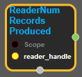
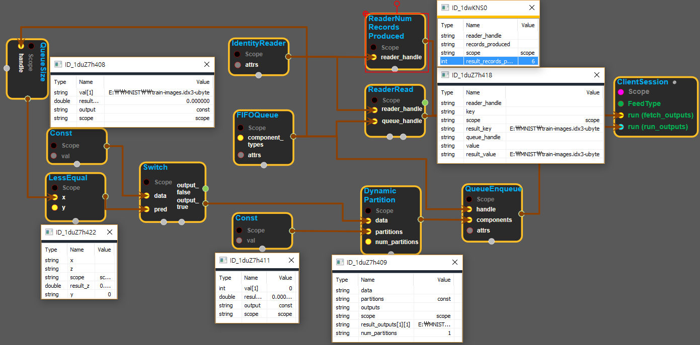

--- 
layout: default 
title: ReaderNumRecordsProduced 
parent: io_ops 
grand_parent: enuSpace-Tensorflow API 
last_modified_date: now 
--- 

# ReaderNumRecordsProduced

---

## tensorflow C++ API

[tensorflow::ops::ReaderNumRecordsProduced](https://www.tensorflow.org/api_docs/cc/class/tensorflow/ops/reader-num-records-produced)

Returns the number of records this Reader has produced.

---

## Summary

This is the same as the number of [ReaderRead](https://www.tensorflow.org/api_docs/cc/class/tensorflow/ops/reader-read.html#classtensorflow_1_1ops_1_1_reader_read) executions that have succeeded.

Arguments:

* scope: A [Scope](https://www.tensorflow.org/api_docs/cc/class/tensorflow/scope.html#classtensorflow_1_1_scope) object
* reader\_handle: Handle to a Reader.

Returns:

* [`Output`](https://www.tensorflow.org/api_docs/cc/class/tensorflow/output.html#classtensorflow_1_1_output): The records\_produced tensor.

Constructor

* ReaderNumRecordsProduced\(const ::tensorflow::Scope & scope, ::tensorflow::Input reader\_handle\).

Public attributes

* tensorflow::Output records\_produced.

---

## ReaderNumRecordsProduced block

Source link : [https://github.com/EXPNUNI/enuSpaceTensorflow/blob/master/enuSpaceTensorflow/tf\_i\_o\_\_ops.cpp](https://github.com/EXPNUNI/enuSpaceTensorflow/blob/master/enuSpaceTensorflow/tf_io_ops.cpp)

Argument:

* Scope scope : A Scope object \(A scope is generated automatically each page. A scope is not connected.\)
* Input reader\_handle: connect  Input node.

Return:

* Output records\_produced: Output object of ReaderNumRecordsProduced class object.  

Result:

* std::vector\(Tensor\) product\_result : Returned object of executed result by calling session.

---

## Using Method

